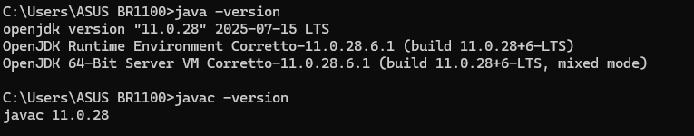
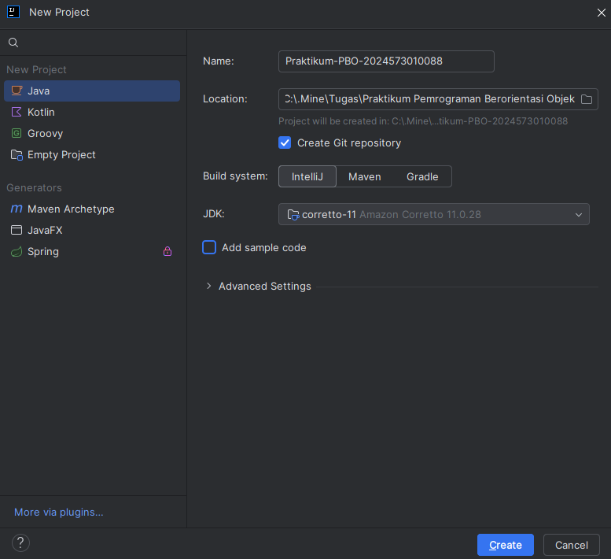
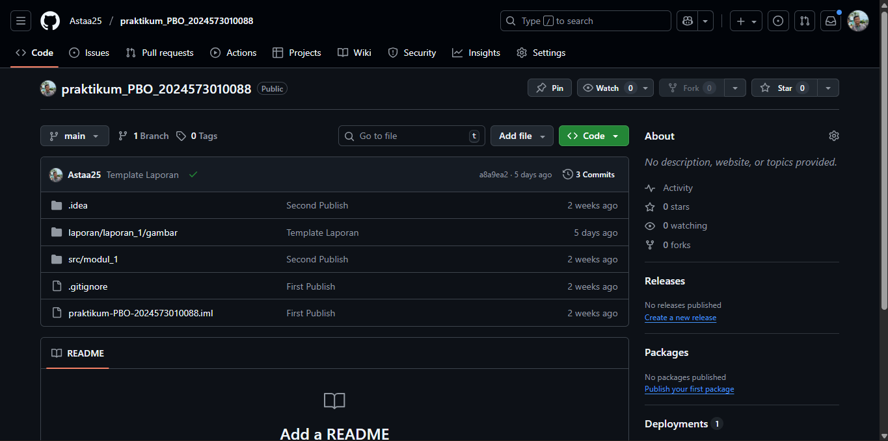
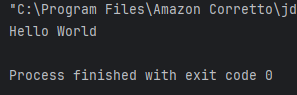

# Laporan Modul 1: Perkenalan Java dan Ekosistemnya
**Mata Kuliah:** Praktikum Pemrograman Berorientasi Objek   
**Nama:** Abrar Astafaraiz  
**NIM:** 2024573010088  
**Kelas:** TI 2A

---

## Abstrak
&emsp;&emsp;Modul ini memperkenalkan mahasiswa kepada pemrograman berorientasi objek (PBO) dengan Java serta menyiapkan lingkungan kerja praktikum untuk pengembangan perangkat lunak. Materi diawali dengan penjelasan mengenai konsep dasar PBO dan keunggulannya, seperti modularitas, reusabilitas, maintainability, dan scalability. Selanjutnya dijelaskan alasan penggunaan Java, antara lain sifat platform-independent, pengetikan yang kuat (strong typing), pustaka yang lengkap, komunitas besar, serta posisinya sebagai bahasa industri.

&emsp;&emsp;Modul ini juga memperkenalkan komponen penting dalam ekosistem Java, yaitu JDK (Java Development Kit), JRE (Java Runtime Environment), JVM (Java Virtual Machine), dan Integrated Development Environment (IDE) sebagai sarana penunjang pengembangan. Melalui praktikum, mahasiswa diarahkan untuk melakukan instalasi JDK (disarankan Amazon Corretto versi LTS), instalasi IntelliJ IDEA Community Edition, persiapan repository proyek dengan GitHub, serta membuat proyek sederhana “Hello World”.

&emsp;&emsp;Dengan adanya modul ini, mahasiswa diharapkan dapat memahami konsep awal PBO, mengenal Java secara mendasar, serta mampu mengatur lingkungan kerja yang diperlukan untuk pengembangan aplikasi.

---

## BAB I - PENDAHULUAN
### 1.1 Latar Belakang
&emsp;&emsp;Pemrograman berorientasi objek (OOP) merupakan paradigma penting dalam pengembangan perangkat lunak modern. Melalui pendekatan ini, kode dipandang sebagai kumpulan objek yang memiliki atribut dan perilaku. Java dipilih sebagai bahasa yang digunakan dalam mata kuliah ini karena mendukung konsep OOP secara penuh, bersifat multiplatform dengan prinsip Write Once, Run Anywhere, serta didukung komunitas global yang besar.

&emsp;&emsp;Sebelum memulai proses pemrograman, diperlukan persiapan lingkungan kerja yang tepat. Tools utama yang digunakan adalah JDK untuk menulis dan mengompilasi program, JRE untuk menjalankan program, serta JVM sebagai mesin virtual yang mengeksekusi bytecode Java di berbagai platform. Untuk mempermudah pengembangan, digunakan IntelliJ IDEA Community Edition sebagai IDE yang menyediakan fitur-fitur modern seperti debugging, refactoring, hingga integrasi dengan version control.

&emsp;&emsp;Selain itu, manajemen project dan kode sumber dilakukan dengan GitHub sebagai repository daring. Hal ini sejalan dengan praktik industri perangkat lunak yang menuntut kolaborasi dan versioning dalam setiap tahap pengembangan. GitHub mempermudah mahasiswa dalam menyimpan, membagikan, dan mengelola project praktikum secara terstruktur.

&emsp;&emsp;Praktikum Lab 01 menjadi langkah awal yang krusial, karena selain mengenalkan teori dasar OOP dan Java, juga membiasakan mahasiswa dalam mempersiapkan environment coding. Melalui instalasi JDK, konfigurasi IDE, setup GitHub repository, hingga pembuatan program sederhana Hello World, mahasiswa dilatih untuk siap menghadapi materi inti pemrograman berorientasi objek pada pertemuan selanjutnya.

### 1.2 Tujuan Penulisan
&emsp;&emsp;Tujuan penulisan laporan ini adalah untuk mendokumentasikan kegiatan praktikum Lab 01 yang berfokus pada pengenalan pemrograman berorientasi objek serta persiapan lingkungan kerja Java. Laporan ini bertujuan agar mahasiswa memahami konsep dasar OOP, mengetahui alasan penggunaan bahasa Java, serta menguasai instalasi dan konfigurasi tools pendukung seperti JDK, JRE, JVM, IntelliJ IDEA, dan GitHub. Dengan dokumentasi ini, mahasiswa diharapkan dapat mengulang kembali langkah-langkah praktikum secara sistematis, sekaligus menilai sejauh mana pemahaman mereka terhadap materi yang dipelajari.

---

## BAB II - PRAKTIKUM
### 2.1 Praktikum 1 - Instalasi JDK 11 (Amazon Corretto)
#### 2.1.1 Dasar Teori

&emsp;&emsp;Amazon Corretto adalah distribusi OpenJDK yang gratis, multiplatform, dan production-ready yang dikembangkan oleh Amazon. Corretto menyediakan long-term support dan performance optimizations yang membuatnya ideal untuk pembelajaran dan development profesional.

#### 2.1.2 Langkah Praktikum

**Langkah 1: Akses Website Amazon Corretto**
1. Buka browser web (Chrome, Firefox, atau Edge)
2. Navigasikan ke alamat: https://aws.amazon.com/corretto/
3. Klik tombol **"Download Amazon Corretto"** yang terletak di bagian tengah halaman
4. Anda akan diarahkan ke halaman download yang menampilkan berbagai versi yang tersedia 

**Langkah 2: Pilih Versi JDK yang Tepat**
1. Pada halaman download, pilih **Amazon Corretto 11** (Long Term Support version)
2. Untuk pembelajaran pemula, **Corretto 11** sangat direkomendasikan karena stabilitas dan compatibility yang baik
3. Pastikan Anda memilih versi yang sesuai dengan arsitektur sistem operasi:
* **Windows x64**: Untuk Windows 64-bit (paling umum)
* **Windows x86**: Untuk Windows 32-bit (jarang digunakan)
* **macOS x64**: Untuk Mac dengan processor Intel
* **macOS aarch64**: Untuk Mac dengan Apple Silicon (M1/M2)
* **Linux x64**: Untuk distribusi Linux 64-bit

**Langkah 3: Download Installer**
1. Klik pada link download yang sesuai dengan sistem operasi Anda
2. Pilih format installer:
* **Windows**: File dengan ekstensi `.msi` (Microsoft Installer)
* **macOS**: File dengan ekstensi `.pkg` (Package Installer)
* **Linux**: File dengan ekstensi `.deb` (untuk Ubuntu/Debian) atau `.rpm` (untuk RedHat/CentOS)
3. Tunggu proses download selesai (ukuran file sekitar 200-300 MB)
4. Pastikan lokasi download mudah diakses (biasanya folder Downloads)

**Langkah 4: Instalasi di Windows**
1. Buka File Explorer dan navigasikan ke folder Downloads
2. Double-click file installer Amazon Corretto (contoh: `amazon-corretto-11-x64-windows-jdk.msi`)
3. Jika muncul dialog "User Account Control", klik **"Yes"** untuk memberikan permission
4. Pada welcome screen installer, klik **"Next"**
5. Baca dan setujui License Agreement dengan mencentang **"I accept the terms in the License Agreement"**, kemudian klik **"Next"**
6. Pada halaman "Custom Setup", biarkan semua komponen tercentang (default installation), klik **"Next"**
7. Catat dengan teliti installation path yang ditampilkan (biasanya: `C:\Program Files\Amazon Corretto\jdk11.x.x_xx\`)
8. Klik **"Install"** untuk memulai proses instalasi
9. Tunggu proses instalasi selesai (biasanya 2-5 menit)
10. Klik **"Finish"** untuk menyelesaikan instalasi

**Langkah 5: Instalasi di macOS**
1. Buka Finder dan navigasikan ke folder Downloads
2. Double-click file installer Amazon Corretto (contoh: `amazon-corretto-11-macos-x64.pkg`)
3. Pada introduction screen, klik **"Continue"**
4. Baca License Agreement dan klik **"Continue"**, kemudian **"Agree"**
5. Pilih destination disk (biasanya Macintosh HD) dan klik **"Continue"**
6. Klik **"Install"** dan masukkan password administrator ketika diminta
7. Tunggu proses instalasi selesai
8. Klik **"Close"** untuk menyelesaikan instalasi
9. JDK akan terinstall di: `/Library/Java/JavaVirtualMachines/amazon-corretto-11.jdk/`

**Langkah 6: Instalasi di Linux (Ubuntu/Debian)**
1. Buka Terminal dengan menekan `Ctrl+Alt+T`
2. Navigasikan ke folder Downloads: `cd ~/Downloads`
3. Install paket .deb dengan command: `sudo dpkg -i amazon-corretto-17-x64-linux-jdk.deb`
4. Jika ada dependency issues, jalankan: `sudo apt-get install -f`
5. Verifikasi instalasi dengan: `dpkg -l | grep corretto`

**Langkah 7: Verifikasi Instalasi**
1. **Windows**: Buka Command Prompt dengan menekan `Win+R`, ketik `cmd`, tekan Enter
2. **macOS**: Buka Terminal dari Applications > Utilities > Terminal
3. **Linux**: Buka Terminal dengan `Ctrl+Alt+T`
4. Ketik command berikut dan tekan Enter:
```declarative
java -version
```
5. Output yang diharapkan akan menampilkan informasi seperti:
```declarative
openjdk version "11.0.x" 2023-xx-xx LTS
OpenJDK Runtime Environment Corretto-11.0.x.x (build 11.0.x+xx-LTS)
OpenJDK 64-Bit Server VM Corretto-11.0.x.x (build 11.0.x+xx-LTS, mixed mode, sharing)
```
6. Selanjutnya, verifikasi compiler dengan mengetik:
```declarative
javac -version
```
7. Output yang diharapkan:
```declarative
javac 11.0.x
```

**Langkah 8: Setup Environment Variables (Khusus Windows)**
1. Klik kanan pada **"This PC"** di desktop atau File Explorer, pilih **"Properties"**
2. Klik **"Advanced system settings"** di panel kiri
3. Pada dialog System Properties, klik **"Environment Variables…"**
4. Di bagian "System variables", klik **"New…"**
5. Masukkan:
* Variable name: `JAVA_HOME`
* Variable value: `C:\Program Files\Amazon Corretto\jdk17.0.x_xx` (sesuaikan dengan versi yang terinstall)
6. Klik **"OK"**
7. Cari variable **"Path"** di System variables, klik **"Edit…"**
8. Klik **"New"** dan tambahkan: `%JAVA_HOME%\bin`
9. Klik **"OK"** pada semua dialog yang terbuka
10. **Restart Command Prompt** untuk menerapkan perubahan

#### 2.1.3 Screenshot Hasil



#### 2.1.4 Analisis dan Pembahasan

🔎 Analisis Program

1. Verifikasi Java  
```declarative
java -version 
javac -version
```

👉 Output perintah di atas menampilkan versi Java yang sudah terpasang di sistem. Hal ini membuktikan bahwa JDK berhasil diinstal dan siap digunakan.

2. Fungsi JDK 

👉 JDK (Java Development Kit) berisi compiler javac untuk mengubah kode Java menjadi bytecode dan JVM (Java Virtual Machine) untuk menjalankan program. Tanpa JDK, program Java tidak bisa dikompilasi maupun dijalankan.

📖 Pembahasan

  Dari hasil praktikum, dapat disimpulkan bahwa JDK sudah terinstal dengan benar. Hal ini penting sebagai fondasi awal dalam pemrograman Java 💻. Instalasi JDK bukan hanya sekadar meletakkan software, tetapi juga menyiapkan environment agar setiap kode yang ditulis bisa dieksekusi dengan baik.

#### 2.1.5 Kesimpulan Praktikum 1

📝 Kesimpulan

&emsp;&emsp;Instalasi JDK berhasil dilakukan dan diverifikasi melalui perintah java -version serta javac -version. Hasilnya menunjukkan bahwa sistem sudah siap untuk digunakan dalam pemrograman Java. Dengan adanya JDK, mahasiswa dapat melakukan kompilasi dan menjalankan program secara langsung, sehingga menjadi langkah awal yang sangat penting dalam memahami konsep pemrograman berorientasi objek.

---

### 2.2 Praktikum 2 – Instalasi IntelliJ IDEA CE

#### 2.2.1 Dasar Teori

&emsp;&emsp;IntelliJ IDEA Community Edition adalah IDE gratis dan powerful yang dikembangkan oleh JetBrains, sangat ideal untuk pembelajaran Java dan development profesional.

#### 2.2.2 Langkah Praktikum

**Langkah 1: Mengakses Website JetBrains**
1. Buka browser web dan navigasikan ke: https://www.jetbrains.com/idea/
2. Pada halaman utama, Anda akan melihat dua pilihan: Ultimate (berbayar) dan Community (gratis)
3. Klik tombol **"Download"** di bawah **"Community Edition"**
4. Anda akan diarahkan ke halaman download yang otomatis mendeteksi sistem operasi Anda

**Langkah 2: Download IntelliJ IDEA**
1. Pastikan tab **"Community"** dipilih (bukan Ultimate)
2. Sistem akan otomatis mendeteksi OS Anda dan menampilkan download button yang sesuai
3. Klik **"Download"** untuk memulai download
4. Ukuran file sekitar 700MB-1GB, pastikan koneksi internet stabil
5. File installer akan tersimpan di folder Downloads dengan nama seperti:
* Windows: `ideaIC-2023.x.x.exe`
* macOS: `ideaIC-2023.x.x.dmg`
* Linux: `ideaIC-2023.x.x.tar.gz`

**Langkah 3: Instalasi di Windows**
1. Navigasikan ke folder Downloads dan double-click file `ideaIC-2023.x.x.exe`
2. Jika Windows menampilkan security warning, klik **"Yes"** atau **"Run anyway"**
3. Pada welcome screen, klik **"Next"**
4. Pilih installation directory (default: `C:\Program Files\JetBrains\IntelliJ IDEA Community Edition 2023.x.x`)
5. Klik **"Next"** untuk melanjutkan
6. Pada Installation Options, centang opsi berikut:
* ✅ **"64-bit launcher"** (untuk sistem 64-bit)
* ✅ **"Add launchers dir to the PATH"**
* ✅ **"Add 'Open Folder as Project'"**
* ✅ **".java"** - Associate .java files
* ✅ **"Download and install JetBrains Runtime"**
7. Klik **"Next"**
8. Pada Start Menu Folder, biarkan default dan klik **"Install"**
9. Tunggu proses instalasi selesai (5-10 menit)
10. Centang **"Run IntelliJ IDEA Community Edition"** dan klik **"Finish"**

**Langkah 4: Instalasi di macOS**
1. Buka file `ideaIC-2023.x.x.dmg` yang telah didownload
2. Drag icon **IntelliJ IDEA CE** ke folder **Applications**
3. Tunggu proses copy selesai
4. Buka **Applications** folder dan double-click **IntelliJ IDEA CE**
5. Jika muncul security warning, klik **"Open"**
6. Jika diminta, masukkan password administrator

**Langkah 5: Instalasi di Linux**
1. Buka Terminal dan navigasikan ke Downloads: `cd ~/Downloads`
2. Extract file tar.gz: `tar -xzf ideaIC-2023.x.x.tar.gz`
3. Pindahkan ke direktori opt: `sudo mv idea-IC-* /opt/idea-ic`
4. Buat symbolic link: `sudo ln -s /opt/idea-ic/bin/idea.sh /usr/local/bin/idea`
5. Jalankan IntelliJ IDEA: `idea`

**Langkah 6: First Time Setup IntelliJ IDEA**
1. Saat pertama kali membuka IntelliJ IDEA, Anda akan melihat "Welcome to IntelliJ IDEA"
2. Pada dialog "Import IntelliJ IDEA Settings", pilih **"Do not import settings"**
3. Klik **"OK"**
4. Pilih UI Theme:
* **"Light"** untuk tema terang (cocok untuk lingkungan terang)
* **"Darcula"** untuk tema gelap (cocok untuk mata yang sensitif)
5. Klik **"Next"**
6. Pada "Default plugins", biarkan semua plugin default tercentang
7. Klik **"Next"**
8. Pada "Featured plugins", Anda bisa skip dulu dengan klik **"Start using IntelliJ IDEA"**

**Langkah 7: Verifikasi Konfigurasi JDK di IntelliJ IDEA**
1. Pada Welcome screen IntelliJ IDEA, klik **"New Project"**
2. Di panel kiri, pilih **"Java"**
3. Pastikan "Project SDK" menampilkan Amazon Corretto yang telah diinstall
4. Jika belum muncul, klik **"Add SDK" → "JDK"**
5. Navigate ke folder instalasi Amazon Corretto:
* Windows: `C:\Program Files\Amazon Corretto\jdk17.0.x_xx`
* macOS: `/Library/Java/JavaVirtualMachines/amazon-corretto-17.jdk/Contents/Home`
* Linux: `/usr/lib/jvm/java-17-amazon-corretto`
6. Klik **"OK"** untuk menambahkan JDK
7. Klik **"Cancel"** untuk keluar dari dialog New Project 

**Langkah 8: Konfigurasi Tambahan (Opsional namun Disarankan)**
1. Pada Welcome screen, klik ⚙️ (gear icon) dan pilih **"Settings"**
2. Navigasikan ke **"Editor" → "General" → "Auto Import"**
3. Centang **"Add unambiguous imports on the fly"**
4. Centang **"Optimize imports on the fly"**
5. Navigasikan ke **"Editor" → "Code Style" → "Java"**
6. Pastikan **"Tab size"** dan **"Indent"** diset ke **4**
7. Klik **"Apply"** dan **"OK"**

**TROUBLESHOOTING UMUM**

**Problem 1: "java" command not found**  
Gejala:  
Ketika mengetik java -version di command line, muncul pesan error "java is not recognized as internal or external command"

Solusi Windows:  
Restart Command Prompt setelah setup Environment Variables. Jika masih tidak berfungsi, pastikan PATH sudah diset dengan benar dan tidak ada typo dalam penulisan path.

Solusi macOS/Linux:  
Jalankan source ~/.bashrc atau restart terminal. Pastikan JDK terinstall di lokasi yang benar.

**Problem 2: IntelliJ IDEA tidak detect JDK**  
Gejala:  
Saat membuat project baru, tidak ada pilihan JDK atau muncul pesan "No SDK"

Solusi:
* Buka File → Project Structure → SDKs
* Klik + dan Add JDK
* Browser ke folder instalasi Amazon Corretto
* Klik OK untuk menambahkan

**Problem 3: Permission denied (Linux)**  
Gejala:  
Error permission saat menjalankan IntelliJ IDEA

Solusi:  
Jalankan command dengan sudo: sudo chmod +x /opt/idea-ic/bin/idea.sh

**Problem 4: Installer corrupt**  
Gejala:  
Installer tidak bisa dibuka atau muncul error saat instalasi

Solusi:  
* Download ulang installer dari website resmi
* Pastikan koneksi internet stabil saat download
* Disable antivirus sementara saat instalasi (jika diperlukan)

#### 2.2.3 Screenshot Hasil



2.2.4 Analisa dan Pembahasan

🔎 Analisis Instalasi IntelliJ IDEA

1. Membuat Project Baru

   👉 Project berhasil dibuat dengan JDK terhubung.


2. Kelebihan IDE

   👉 Mempermudah pemrograman dengan auto-complete, deteksi error real-time, dan debugging.

📖 Pembahasan

  Dengan IntelliJ IDEA, mahasiswa dapat menulis kode dengan lebih efisien dan rapi. IDE ini mempermudah proses belajar Java.

#### 2.2.5 Kesimpulan Praktikum 2

📝 Kesimpulan

  IntelliJ IDEA berhasil diinstal dan siap digunakan untuk membuat project Java.


---

### 2.3 Praktikum 3 – Clone Repository GitHub

#### 2.3.1 Dasar Teori

&emsp;&emsp;GitHub adalah platform hosting untuk version control menggunakan Git. Dengan GitHub, programmer bisa menyimpan, mengelola, dan berbagi kode secara kolaboratif.

#### 2.3.2 Langkah Praktikum
1. Install git jika belum ada (https://git-scm.com/)
2. Buatkan akun github (jika belum ada). https://github.com/
3. Buatkan sebuah repository baru dengan nama `praktikum-pbo-<nim anda>`
4. Tentukan direktori dimana anda akan menyimpan projek matakuliah ini, kemudian buka `git bash` dan masuk ke direktorinya dengan perintah `cd <nama direktori>`
5. Clone project tersebut dengan perintah `git clone <url repositori>`. Untuk url repositori, anda bisa dapatkan di repositori github anda
6. Buka project yang sudah anda clone diatas dengan Intellj.
7. Buatkan file dan folder baru dengan struktur berikut di dalam repo yang sudah anda clone dengan ketentuan berikut:
```declarative
praktikum-pbo/
├── .gitignore
├── README.md                  ← Biarkan kosong untuk sementara
├── laporan/
    ├── laporan1/          
        ├── laporan.md         ← Contoh laporan (format Markdown)
│       └── gambar/
│           └── gambar.png     ← Contoh gambar yang di masukkan ke dalam laporan
├── projects/                   ← placeholder untuk ujicoba praktikum

```

#### 2.3.3 Screenshot Hasil



#### 2.3.4 Analisa dan Pembahasan

🔎 Analisis Clone Repository

1. Perintah Git

`git clone <url-repo>`

👉 Repository berhasil digandakan ke komputer lokal.

2. Manfaat GitHub

   👉 Menyediakan version control dan kolaborasi kode.

📖 Pembahasan

  Clone repository membiasakan mahasiswa bekerja dengan cara yang profesional, menggunakan version control untuk mengelola kode.

#### 2.3.5 Kesimpulan Praktikum 3

📝 Kesimpulan

  Repository GitHub berhasil diclone, menunjukkan mahasiswa dapat mulai mengelola project dengan version control.

---

### 2.4 Praktikum 4 – Program Hello World

#### 2.4.1 Dasar Teori

&emsp;&emsp;Program Hello World adalah program sederhana yang digunakan untuk menguji apakah lingkungan pengembangan sudah berfungsi dengan baik.

#### 2.4.2 Langkah Praktikum

1. Buat sebuah project baru di intellj dengan memilih `file -> new -> project`
2. Pastikan teknology, lokasi penyimpanan sesuai
3. Checklist pada tulisan `Create Git repository`
4. Buat sebuah java class baru dan beri nama `Main` dengan klik kanan pada folder `src` pilih `new -> Java Class`
5. Tuliskan kode berikut:
```declarative
public class Main {
    public static void main(String[] args) {
        System.out.println("Hello World");
    }
}
```
6. Jalankan programnya dan cek hasil nya

#### 2.4.3 Screenshot Hasil



2.4.4 Analisa dan Pembahasan

🔎 Analisis Program

1. Struktur Program

   👉 Program menggunakan main() sebagai titik awal eksekusi.

2. Output

   👉 Konsol menampilkan teks Hello World, tanda bahwa semua setup sudah benar.

📖 Pembahasan

  Program Hello World menegaskan bahwa instalasi JDK, IntelliJ, dan GitHub telah siap digunakan.

#### 2.4.5 Kesimpulan Praktikum 4

📝 Kesimpulan

  Program berhasil dijalankan dengan menampilkan teks Hello World. Ini menandakan seluruh instalasi dan konfigurasi berjalan sukses.

---

## BAB III – PENUTUP

### 3.1 Kesimpulan

&emsp;&emsp;Laporan praktikum ini membahas proses instalasi dan konfigurasi lingkungan Java, mulai dari JDK, IntelliJ IDEA, GitHub, hingga uji coba program Hello World. Dari praktikum ini mahasiswa mempelajari cara menyiapkan lingkungan pemrograman yang benar.

&emsp;&emsp;Hasil praktikum menunjukkan bahwa JDK berhasil terpasang dan diverifikasi, IntelliJ IDEA dapat digunakan untuk membuat project baru, repository GitHub berhasil diclone, serta program Java pertama berhasil dijalankan.

&emsp;&emsp;Dengan selesainya praktikum ini, mahasiswa tidak hanya memahami teori, tetapi juga mampu melakukan implementasi langsung dalam setup lingkungan pemrograman.

&emsp;&emsp;Praktikum ini menjadi langkah awal yang penting sebelum masuk ke materi inti pemrograman berorientasi objek.

&emsp;&emsp;Secara keseluruhan, laporan ini menunjukkan kesiapan mahasiswa dalam mempelajari Java lebih lanjut, baik dari sisi teknis maupun metodologis.

---

## BAB IV - REFERENSI
Modul Praktikum 1 by Pak Muhammad Reza Zulman, S.ST., M.Sc.
* https://hackmd.io/@mohdrzu/ByrYifVFeg

Amazon Corretto – OpenJDK Distribution
*  https://aws.amazon.com/corretto/

JetBrains IntelliJ IDEA Documentation
* https://www.jetbrains.com/idea/

GitHub Repositories
* https://github.com/Astaa25/praktikum_PBO_2024573010088/

W3Schools – Java Tutorial
* https://www.w3schools.com/java/