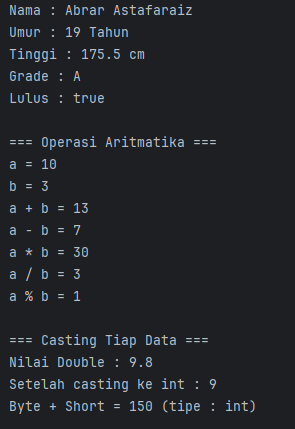
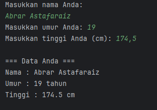
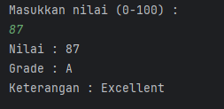
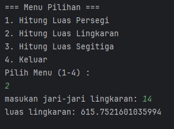
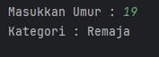
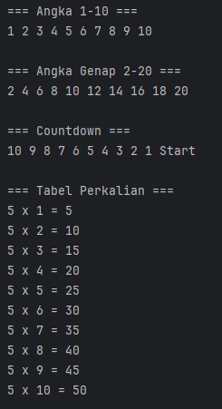
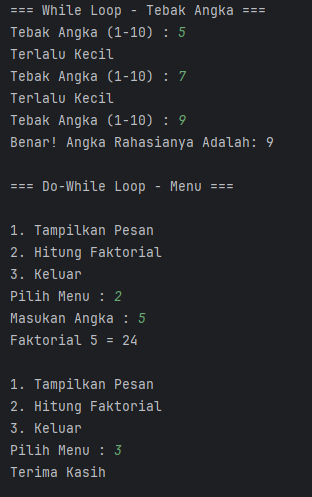
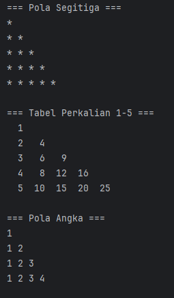

# Laporan Modul 2: Dasar Pemrograman Java
**Mata Kuliah:** Praktikum Pemrograman Berorientasi Objek   
**Nama:** Abrar Astafaraiz  
**NIM:** 2024573010088  
**Kelas:** TI 2A

---

## BAB I - PENDAHULUAN 
&emsp;&emsp;Modul ini dirancang untuk memberikan pemahaman dasar tentang pemrograman Java melalui praktikum langsung. Setiap praktikum dilengkapi dengan teori dasar dan langkah-langkah implementasi yang detail.  

### 1.1 Latar Belakang

&emsp;&emsp;Pemrograman merupakan salah satu dasar penting dalam dunia teknologi informasi, karena melalui pemrograman seseorang dapat memberikan instruksi yang dapat dijalankan oleh komputer. Seiring berkembangnya zaman, berbagai bahasa pemrograman telah hadir dengan kelebihan dan kekurangannya masing-masing, salah satunya adalah bahasa pemrograman Java. Java menjadi salah satu bahasa yang banyak digunakan karena sifatnya yang multiplatform, artinya program yang ditulis dengan Java dapat dijalankan di berbagai sistem operasi tanpa banyak perubahan. Kemampuan inilah yang menjadikan Java relevan untuk dipelajari oleh mahasiswa jurusan teknik informatika sebagai bekal untuk memahami dasar logika pemrograman sekaligus penerapan nyata dalam pembuatan aplikasi.

&emsp;&emsp;Belajar pemrograman dengan Java memberikan pemahaman mendalam mengenai konsep dasar seperti variabel, tipe data, operator, hingga struktur kontrol yang menjadi pondasi dalam pembuatan program. Konsep-konsep ini tidak hanya penting untuk menulis kode yang benar, tetapi juga membantu mahasiswa dalam membentuk pola pikir komputasional, yaitu kemampuan menyelesaikan masalah dengan pendekatan sistematis dan logis. Dengan penguasaan konsep dasar tersebut, mahasiswa akan lebih mudah dalam memahami konsep yang lebih kompleks di kemudian hari seperti pemrograman berorientasi objek, pembuatan antarmuka grafis, maupun pengembangan aplikasi berbasis jaringan.

&emsp;&emsp;Selain itu, penggunaan Java dalam praktikum dasar pemrograman juga melatih kedisiplinan mahasiswa dalam mengikuti aturan sintaks yang ketat. Java termasuk bahasa pemrograman yang strongly typed, sehingga setiap variabel harus didefinisikan dengan jelas tipe datanya. Hal ini melatih mahasiswa untuk teliti dan cermat dalam menuliskan kode agar dapat dijalankan dengan benar tanpa error. Tidak hanya sekadar menulis program, mahasiswa juga dituntut untuk memahami alur logika yang mereka bangun, sehingga dapat melakukan analisis dan debugging apabila terjadi kesalahan pada program yang dibuat.

&emsp;&emsp;Dengan adanya praktikum ini, mahasiswa diharapkan tidak hanya menguasai teori dasar Java, tetapi juga mampu menerapkannya dalam bentuk program sederhana yang dapat dijalankan dan diuji. Proses praktikum menjadi sarana latihan nyata bagi mahasiswa untuk menghubungkan pengetahuan teoritis yang diperoleh di kelas dengan keterampilan teknis yang dibutuhkan dalam dunia kerja. Oleh karena itu, penyusunan laporan ini penting dilakukan sebagai bentuk dokumentasi dari setiap tahapan praktikum, mulai dari penulisan kode, pengujian, hingga analisis hasil yang diperoleh.

### 1.2 Tujuan Penulisan

&emsp;&emsp;Tujuan dari penulisan laporan ini adalah untuk mendokumentasikan hasil pembelajaran mahasiswa pada mata kuliah dasar pemrograman Java melalui serangkaian praktikum yang telah dilaksanakan. Laporan ini bertujuan memberikan gambaran yang jelas mengenai pemahaman mahasiswa terhadap konsep dasar pemrograman, mulai dari pengenalan bahasa Java, penerapan tipe data dan variabel, penggunaan operator, hingga penyusunan logika sederhana dalam bentuk program. Selain itu, laporan ini juga diharapkan dapat melatih mahasiswa agar mampu menganalisis permasalahan yang muncul saat menulis kode, menemukan solusi yang tepat, serta mengembangkan pola pikir logis yang sistematis. Dengan adanya laporan ini, mahasiswa tidak hanya melatih keterampilan teknis dalam menulis program, tetapi juga mengasah kemampuan akademis dalam menyusun laporan ilmiah yang baik, sehingga pada akhirnya dapat memberikan manfaat baik sebagai sarana evaluasi maupun sebagai dasar pengembangan kemampuan di bidang pemrograman pada tahap selanjutnya.

---

## BAB II - PRAKTIKUM
### 2.1 Praktikum 1 - Variabel dan Tipe Data
#### 2.1.1 Dasar Teori

&emsp;&emsp;Java memiliki dua kategori tipe data:

**Tipe Data Primitif :**

* byte: 8-bit signed integer (-128 to 127)  
* short: 16-bit signed integer (-32,768 to 32,767)  
* int: 32-bit signed integer (-2,147,483,648 to 2,147,483,647)  
* long: 64-bit signed integer  
* float: 32-bit IEEE 754 floating point  
* double: 64-bit IEEE 754 floating point  
* boolean: true atau false  
* char: 16-bit Unicode character

**Tipe Data Reference :**

* String, Array, Object, dll.

**Aturan Penamaan Variabel :**

* Dimulai dengan huruf, underscore (_), atau dollar sign ($)
* Tidak boleh dimulai dengan angka
* Case sensitive
* Tidak boleh menggunakan keyword Java

#### 2.1.2 Langkah Praktikum
1. Buat sebuah package baru dengan nama modul_2 di dalam folder src
2. Buat file baru dengan nama VariabelDemo.java
3. Ketik kode berikut:

```declarative
package modul_2;

public class VariabelDemo {
    public static void main(String[] args) {
        // Deklarasi dan Inisialisasi Variabel
        int umur = 19 ;
        double tinggi = 175.5;
        char grade = 'A';
        boolean lulus = true;
        String nama = "Abrar Astafaraiz";

        // Menampilkan Nilai Variabel
        System.out.println("Nama : " + nama);
        System.out.println("Umur : " + umur + " Tahun");
        System.out.println("Tinggi : " + tinggi + " cm");
        System.out.println("Grade : " + grade);
        System.out.println("Lulus : " + lulus);

        int a = 10;
        int b = 3;

        System.out.println("\n=== Operasi Aritmatika ===");
        System.out.println("a = " + a);
        System.out.println("b = " + b);
        System.out.println("a + b = " + (a + b));
        System.out.println("a - b = " + (a - b));
        System.out.println("a * b = " + (a * b));
        System.out.println("a / b = " + (a / b));
        System.out.println("a % b = " + (a % b));

        System.out.println("\n=== Casting Tiap Data ===");
        double nilaiDouble = 9.8;
        int nilaiInt = (int) nilaiDouble;

        System.out.println("Nilai Double : " + nilaiDouble);
        System.out.println("Setelah casting ke int : " + nilaiInt);

        // Automatic Promotion
        byte byteVar = 50;
        short shortVar = 100;
        int hasil = byteVar + shortVar;
        System.out.println("Byte + Short = " + hasil + " (tipe : int)");
    }
}
```

#### 2.1.3 Screenshoot Hasil



#### 2.1.4 Analisa dan Pembahasan

🔎 Analisis Program

1. Deklarasi dan Inisialisasi Variabel

&emsp;&emsp;Di awal program, dibuat berbagai macam variabel dengan tipe data berbeda:

```declarative
int umur = 19;
double tinggi = 175.5;
char grade = 'A';
boolean lulus = true;
String nama = "Abrar Astafaraiz";
```

👉 Artinya, program ini memperkenalkan berbagai tipe data di Java:

* int → bilangan bulat  
* double → bilangan pecahan/desimal
* char → karakter tunggal
* boolean → nilai logika (true/false)
* String → teks


&emsp;&emsp;Semua variabel kemudian ditampilkan dengan System.out.println().

2. Operasi Aritmatika Dasar

```declarative
int a = 10;
int b = 3;

System.out.println("a + b = " + (a + b));
System.out.println("a - b = " + (a - b));
System.out.println("a * b = " + (a * b));
System.out.println("a / b = " + (a / b));
System.out.println("a % b = " + (a % b));
```

👉 Hasil yang keluar adalah:

a + b = 13  
a - b = 7  
a * b = 30
a / b = 3 (karena pembagian integer, hasil pecahan dibulatkan)  
a % b = 1 (sisa bagi)  


&emsp;&emsp;Hal ini menunjukkan cara kerja operator dasar +, -, *, /, % di Java.

3. Type Casting (Konversi Tipe Data)

```declarative
double nilaiDouble = 9.8;
int nilaiInt = (int) nilaiDouble;
```

👉 Proses ini disebut type casting → mengubah tipe data double menjadi int.

Nilai awal: 9.8  
Setelah casting: 9 (desimal dibuang, bukan dibulatkan).


4. Automatic Promotion (Promosi Tipe Data)

```declarative
byte byteVar = 50;  
short shortVar = 100;  
int hasil = byteVar + shortVar;
```

👉 Operasi aritmatika di Java secara otomatis mempromosikan tipe data kecil (byte, short) menjadi int saat dihitung.

50 (byte) + 100 (short) → diproses sebagai int  
hasil bertipe int dengan nilai 150.

📖 Pembahasan

&emsp;&emsp;Dari program di atas, bisa disimpulkan bahwa:

1. Variabel di Java harus dideklarasikan dengan tipe data yang sesuai. Setiap tipe punya fungsi: int untuk bilangan bulat, double untuk desimal, char untuk karakter, boolean untuk logika, dan String untuk teks.
2. Operasi aritmatika mendukung pengurangan, perkalian, pembagian, dan modulus. Untuk tipe int, hasil pembagian otomatis dibulatkan ke bawah (floor). Jadi 10 / 3 = 3, bukan 3.333....
3. Type casting memberikan fleksibilitas dalam mengubah tipe data. Namun, jika dari double ke int, angka desimal akan hilang, bukan dibulatkan. Hal ini penting diperhatikan agar tidak terjadi kehilangan data yang tidak diinginkan.
4. Automatic promotion menjamin operasi aritmatika antar tipe kecil (byte, short) bisa berjalan dengan aman dengan menaikkannya ke int. Inilah sebabnya hasil byte + short tidak bisa langsung disimpan ke byte tanpa casting manual.

#### 2.1.5 Kesimpulan Praktikum 1

📝 Kesimpulan 

&emsp;&emsp;Kode Java yang saya buat adalah contoh praktikum dasar variabel dan operasi aritmatika di Java. Program ini memperkenalkan:

* Cara deklarasi dan inisialisasi variabel berbagai tipe data.
* Cara melakukan operasi aritmatika dasar (-, *, /, %).
* Type casting dari double ke int untuk menunjukkan efek konversi data.
* Automatic promotion pada operasi variabel bertipe byte dan short yang otomatis diubah menjadi int.

&emsp;&emsp;Dengan pemahaman ini, mahasiswa bisa mengerti bahwa pemilihan tipe data sangat penting dalam pemrograman, karena akan mempengaruhi hasil perhitungan dan penggunaan memori.

---

### 2.2 Praktikum 2 - Input, Output, dan Scanner

#### 2.2.1 Dasar Teori

&emsp;&emsp;Untuk membaca input dari pengguna dalam Java, kita menggunakan class Scanner yang terdapat dalam package java.util. Scanner menyediakan berbagai method untuk membaca berbagai tipe data:

* nextInt(): membaca integer
* nextDouble(): membaca double
* nextLine(): membaca String (termasuk spasi)
* next(): membaca String (sampai spasi pertama)
* nextBoolean(): membaca boolean

#### 2.2.2 Langkah Praktikum

1. Buat file baru dengan nama InputOutputDemo.java
2. Ketik kode berikut:
```declarative
package modul_2;

import java.util.Scanner;

public class InputOutputDemo {
    public static void main(String[] args) {
        // Membuat Objek Scanner
        Scanner input = new Scanner(System.in);

        // Membaca input string
        System.out.println("Masukkan nama Anda: ");
        String nama = input.nextLine();

        // Membaca input integer
        System.out.print("Masukkan umur Anda: ");
        int umur = input.nextInt();
        // Membaca input double
        System.out.print("Masukkan tinggi Anda (cm): ");
        double tinggi = input.nextDouble();

        // Menampilkan output
        System.out.println("\n=== Data Anda ===");
        System.out.println("Nama : " + nama);
        System.out.println("Umur : " + umur + " tahun");
        System.out.println("Tinggi : " + tinggi + " cm");

        // Menutup Scanner
        input.close();
    }
}
```

#### 2.2.3 Screenshoot Hasil



#### 2.1.4 Analisa dan Pembahasan
🔎 Analisis Program

&emsp;&emsp;**Deklarasi dan Inisialisasi Variabel**

Di awal program, dibuat berbagai macam variabel dengan tipe data berbeda:
```declarative
int umur = 19;
double tinggi = 175.5;
char grade = 'A';
boolean lulus = true;
String nama = "Abrar Astafaraiz";
```

👉 Artinya, program ini memperkenalkan berbagai tipe data di Java:

int → bilangan bulat  
double → bilangan pecahan/desimal  
char → karakter tunggal  
boolean → nilai logika (true/false)  
String → teks  

&emsp;&emsp;Semua variabel kemudian ditampilkan dengan System.out.println().

Operasi Aritmatika Dasar
```declarative
int a = 10;
int b = 3;

System.out.println("a + b = " + (a + b));
System.out.println("a - b = " + (a - b));
System.out.println("a * b = " + (a * b));
System.out.println("a / b = " + (a / b));
System.out.println("a % b = " + (a % b));
```
👉 Hasil yang keluar adalah:

a + b = 13  
a - b = 7  
a * b = 30 a / b = 3 (karena pembagian integer, hasil pecahan dibulatkan)  
a % b = 1 (sisa bagi)

&emsp;&emsp;Hal ini menunjukkan cara kerja operator dasar +, -, *, /, % di Java.

Type Casting (Konversi Tipe Data)  
double nilaiDouble = 9.8;  
int nilaiInt = (int) nilaiDouble;  
👉 Proses ini disebut type casting → mengubah tipe data double menjadi int.

Nilai awal: 9.8  
Setelah casting: 9 (desimal dibuang, bukan dibulatkan).

Automatic Promotion (Promosi Tipe Data) 
```declarative
byte byteVar = 50;  
short shortVar = 100;  
int hasil = byteVar + shortVar;
```

👉 Operasi aritmatika di Java secara otomatis mempromosikan tipe data kecil (byte, short) menjadi int saat dihitung.

50 (byte) + 100 (short) → diproses sebagai int  
hasil bertipe int dengan nilai 150.

📖 Pembahasan

Dari program di atas, bisa disimpulkan bahwa:

Variabel di Java harus dideklarasikan dengan tipe data yang sesuai. Setiap tipe punya fungsi: int untuk bilangan bulat, double untuk desimal, char untuk karakter, boolean untuk logika, dan String untuk teks.

Operasi aritmatika mendukung pengurangan, perkalian, pembagian, dan modulus. Untuk tipe int, hasil pembagian otomatis dibulatkan ke bawah (floor). Jadi 10 / 3 = 3, bukan 3.333....

Type casting memberikan fleksibilitas dalam mengubah tipe data. Namun, jika dari double ke int, angka desimal akan hilang, bukan dibulatkan. Hal ini penting diperhatikan agar tidak terjadi kehilangan data yang tidak diinginkan.

Automatic promotion menjamin operasi aritmatika antar tipe kecil (byte, short) bisa berjalan dengan aman dengan menaikkannya ke int. Inilah sebabnya hasil byte + short tidak bisa langsung disimpan ke byte tanpa casting manual.

#### 2.1.5 Kesimpulan Praktikum 1
📝 Kesimpulan

Kode Java yang saya buat adalah contoh praktikum dasar variabel dan operasi aritmatika di Java. Program ini memperkenalkan:
1. Cara deklarasi dan inisialisasi variabel berbagai tipe data.
2. Cara melakukan operasi aritmatika dasar (-, *, /, %).
3. Type casting dari double ke int untuk menunjukkan efek konversi data.
4. Automatic promotion pada operasi variabel bertipe byte dan short yang otomatis diubah menjadi int.

  Dengan pemahaman ini, mahasiswa bisa mengerti bahwa pemilihan tipe data sangat penting dalam pemrograman, karena akan mempengaruhi hasil perhitungan dan penggunaan memori.

---

### 2.3 Praktikum 3 - Struktur Control: Percabangan

#### 2.3.1 Dasar Teori

&emsp;&emsp;Struktur kontrol percabangan digunakan untuk membuat keputusan dalam program. Java menyediakan beberapa statement percabangan:

**If Statement**
```declarative
if (kondisi) {
// kode yang dijalankan jika kondisi true
}
```
**If-Else Statement**
```declarative
if (kondisi) {
// kode jika kondisi true
} else {
// kode jika kondisi false
}
```
**If-Else If-Else Statement**
```declarative
if (kondisi1) {
// kode jika kondisi1 true
} else if (kondisi2) {
// kode jika kondisi2 true
} else {
// kode jika semua kondisi false
}
```
**Switch Statement**
```declarative
switch (variabel) {
case nilai1:
// kode
break;
case nilai2:
// kode
break;
default:
// kode default
}
```

#### 2.3.2 Langkah Praktikum

**🌟 Program Penentu Grade**
1. Buat file baru dengan nama GradeDemo.java
2. Implementasikan kode berikut:
```declarative
package modul_2;

import java.util.Scanner;

public class GradeDemo {
    public static void main(String[] args) {
        Scanner input = new Scanner(System.in);

        System.out.println("Masukkan nilai (0-100) : ");
        int nilai = input.nextInt();

        char grade;
        String keterangan;

        // Menggunakan If-Else If-Else
        if (nilai >= 85) {
            grade = 'A';
            keterangan = "Excellent";
        } else if (nilai >= 75) {
            grade = 'B';
            keterangan = "Good";
        } else if (nilai >= 65) {
            grade = 'C';
            keterangan = "Fair";
        } else if (nilai >= 55) {
            grade = 'D';
            keterangan = "Poor";
        } else {
            grade = 'E';
            keterangan = "Fail";
        }

        System.out.println("Nilai : " + nilai);
        System.out.println("Grade : " + grade);
        System.out.println("Keterangan : " + keterangan);

        input.close();
    }
}
```

**🖱️ Program Menu Dengan Switch**
1. Buat file baru dengan nama MenuDemo.java
2. Implementasikan kode berikut:
```declarative
package modul_2;

import java.util.Scanner;

public class MenuDemo {
    public static void main(String[] args) {
        Scanner input = new Scanner(System.in);

        System.out.println("=== Menu Pilihan ===");
        System.out.println("1. Hitung Luas Persegi");
        System.out.println("2. Hitung Luas Lingkaran");
        System.out.println("3. Hitung Luas Segitiga");
        System.out.println("4. Keluar");

        System.out.println("Pilih Menu (1-4) : ");
        int pilihan = input.nextInt();

        switch (pilihan) {
            case 1:
                System.out.println("Masukkan Sisi Persegi : ");
                double sisi = input.nextDouble();
                double luasPersegi = sisi * sisi;
                System.out.println("Luas Persegi : " + luasPersegi);
                break;

            case 2:
                System.out.print("masukan jari-jari lingkaran: ");
                double jariJari = input.nextDouble();
                double luasLingkaran = Math.PI * jariJari * jariJari;
                System.out.println("luas lingkaran: " + luasLingkaran);
                break;
            case 3:
                System.out.print("masukan alas segitiga: ");
                double alas = input.nextDouble();
                System.out.print("masukan tinggi segitiga: ");
                double tinggi = input.nextDouble();
                double luasSegitiga = 0.5 * alas * tinggi;
                System.out.println("luas segitiga: " + luasSegitiga);
            case 4:
                System.out.println("terima kasih telah menggunakan program ini");
                break;
            default:
                System.out.println("pilihan tidak valid");
        }
        input.close();
    }
}
```

**🕸️ Program Nested If**
1. Buat file baru dengan nama NestedIfDemo.java
2. Implementasikan program untuk menentukan kategori usia:
```declarative
package modul_2;

import java.util.Scanner;

public class NestedIfDemo {
    public static void main(String[] args){
        Scanner input = new Scanner(System.in);

        System.out.print("Masukkan Umur : ");
        int umur = input.nextInt();

        if(umur>= 0){
            if(umur<= 2){
                System.out.println("Kategori : Bayi");
            } else if (umur <= 5) {
                System.out.println("Kategori : Balita");
            } else if (umur <= 12) {
                System.out.println("Kategori : Anak-anak");
            } else if (umur <= 19) {
                System.out.println("Kategori : Remaja");
            } else if (umur <= 59) {
                System.out.println("Kategori : Dewasa");
            }else {
                System.out.println("Kategori : Lansia");
            }
        }else{
            System.out.println("Umur Tidak Valid !");
        }
        input.close();
    }
}
```

#### 2.3.3 Screenshoot Hasil

**🌟 Program Penentu Grade :**  


**🖱️ Program Menu Dengan Switch :**   


**🕸️ Program Nested If :**  


#### 2.3.4 Analisa dan Pembahasan

🔎 Analisis Program

1. Program Penentu Grade (If-Else If-Else)
```declarative
if (nilai >= 85) {
grade = 'A';
keterangan = "Excellent";
} else if (nilai >= 75) {
grade = 'B';
keterangan = "Good";
} else if (nilai >= 65) {
grade = 'C';
keterangan = "Fair";
} else if (nilai >= 55) {
grade = 'D';
keterangan = "Poor";
} else {
grade = 'E';
keterangan = "Fail";
}
```

👉 Artinya, program ini menggunakan if-else berantai untuk menentukan nilai huruf dan keterangan.
* Input angka (0–100) dibandingkan dengan beberapa kondisi.
* Hanya satu blok yang dijalankan, sesuai kondisi yang terpenuhi.
* Jika nilai 85 ke atas → A (Excellent), sedangkan nilai < 55 → E (Fail).

2. Program Menu Dengan Switch-Case
```declarative
switch (pilihan) {
case 1:
System.out.println("Luas Persegi : " + (sisi * sisi));
break;
case 2:
System.out.println("Luas Lingkaran : " + (Math.PI * jariJari * jariJari));
break;
case 3:
System.out.println("Luas Segitiga : " + (0.5 * alas * tinggi));
break;
case 4:
System.out.println("Terima kasih telah menggunakan program ini");
break;
default:
System.out.println("Pilihan tidak valid");
}
```

👉 Program ini menggunakan switch untuk menampilkan menu pilihan.
* case 1–3 menghitung luas bangun datar.
* case 4 keluar dari program.
* Jika input tidak valid, default akan dijalankan.

3. Program Nested If (If Bersarang)

```declarative
if (umur >= 0) {
if (umur <= 2) {
System.out.println("Kategori : Bayi");
} else if (umur <= 5) {
System.out.println("Kategori : Balita");
} else if (umur <= 12) {
System.out.println("Kategori : Anak-anak");
} else if (umur <= 19) {
System.out.println("Kategori : Remaja");
} else if (umur <= 59) {
System.out.println("Kategori : Dewasa");
} else {
System.out.println("Kategori : Lansia");
}
} else {
System.out.println("Umur Tidak Valid !");
}
```

👉 Program ini menggunakan if bersarang untuk menentukan kategori usia:
* Pertama dicek apakah input valid (umur >= 0).
* Jika valid, umur dipetakan ke kategori: bayi, balita, anak-anak, remaja, dewasa, atau lansia.
* Jika tidak valid (negatif), tampil pesan error.

📖 Pembahasan

&emsp;&emsp;Dari ketiga program di atas, terlihat bahwa Java menyediakan berbagai bentuk percabangan:
1. If-Else cocok untuk kondisi berurutan (misalnya nilai → grade). Program akan berhenti di kondisi yang benar pertama kali.
2. Switch-Case lebih rapi ketika ada banyak pilihan yang bersifat diskrit (misalnya menu). Namun programmer harus hati-hati menambahkan break agar tidak terjadi fall-through.
3. Nested If sesuai untuk kondisi yang bertingkat (hirarki), misalnya penentuan kategori umur. Kondisi umum diperiksa dulu, kemudian dilanjutkan ke kondisi yang lebih detail.

&emsp;&emsp;Secara umum, percabangan memungkinkan program mengambil keputusan dinamis sesuai input pengguna.

#### 2.3.5 Kesimpulan Praktikum 3

📝 Kesimpulan

Praktikum ini menunjukkan bahwa struktur kontrol percabangan adalah komponen penting dalam logika pemrograman.
* Dengan If-Else, program dapat menangani kondisi rentang nilai.
* Dengan Switch-Case, program bisa membuat menu interaktif yang rapi dan mudah dipahami.
* Dengan Nested If, program dapat mengelompokkan data ke dalam kategori yang lebih spesifik.

&emsp;&emsp;Pemahaman perbedaan dan penggunaan yang tepat dari masing-masing jenis percabangan membantu programmer memilih struktur logika yang sesuai dengan kebutuhan program. Hal ini menjadikan kode lebih jelas, terstruktur, dan mudah dikelola.

---

### 2.4 Praktikum 4 - Struktur Control: Perulangan

#### 2.4.1 Dasar Teori

Perulangan (loop) digunakan untuk mengulang eksekusi kode tertentu. Java menyediakan tiga jenis perulangan:

For Loop
```declarative
for (inisialisasi; kondisi; increment/decrement) {
// kode yang diulang
}
```

While Loop
```declarative
while (kondisi) {
// kode yang diulang
}
```

Do-While Loop
```declarative
do {
// kode yang diulang
} while (kondisi);
```

#### 2.4.2 Langkah Praktikum
**🔄 Perulangan For**  
1. Buat file baru dengan nama ForLoopDemo.java
2. Implementasikan berbagai contoh for loop:
```declarative
package modul_2;

public class ForLoopDemo {
    public static void main(String[] args){
        System.out.println("=== Angka 1-10 ===");
        for(int i = 1; i <= 10; i++){
            System.out.print(i + " ");
        }
        System.out.println();

        System.out.println("\n=== Angka Genap 2-20 ===");
        for(int i = 2; i <= 20; i+= 2){
            System.out.print(i + " ");
        }
        System.out.println();

        System.out.println("\n=== Countdown ===");
        for(int i = 10; i>=1; i--){
            System.out.print(i + " ");
        }
        System.out.println("Start");

        System.out.println("\n=== Tabel Perkalian ===");
        for(int i = 1; i<= 10; i++){
            System.out.println("5 x " + i + " = " + (5*i));
        }
    }
}
```

**💫 Perulangan While dan Do-While**  
1. Buat file baru dengan nama WhileLoopDemo.java
2. Implementasikan contoh while dan do-while:
```declarative
package modul_2;

import java.util.Scanner;

public class WhileLoopDemo {
    public static void main(String[] args){
        Scanner input = new Scanner(System.in);

        // Contoh While Loop
        System.out.println("=== While Loop - Tebak Angka ===");
        int angkarahasia = 9;
        int tebakan = 0;

        while(tebakan != angkarahasia){
            System.out.print("Tebak Angka (1-10) : ");
            tebakan = input.nextInt();

            if(tebakan < angkarahasia){
                System.out.println("Terlalu Kecil");
            } else if (tebakan > angkarahasia) {
                System.out.println("Terlalu Besar");
            }else{
                System.out.println("Benar! Angka Rahasianya Adalah: " + angkarahasia);
            }
        }

        // Contoh Do-While Loop
        System.out.println("\n=== Do-While Loop - Menu ===");
        int pilihan;

        do {
            System.out.println("\n1. Tampilkan Pesan");
            System.out.println("2. Hitung Faktorial");
            System.out.println("3. Keluar");
            System.out.print("Pilih Menu : ");
            pilihan = input.nextInt();

            switch (pilihan){
                case 1:
                    System.out.println("Hello World");
                    break;
                case 2:
                    System.out.print("Masukan Angka : ");
                    int n = input.nextInt();
                    long faktorial = 1;
                    for(int i =1; i <n ; i++){
                        faktorial *= i;
                    }
                    System.out.println("Faktorial " + n + " = " + faktorial);
                    break;
                case 3:
                    System.out.println("Terima Kasih");
                    break;
                default:
                    System.out.println("Pilihan Tidak Valid");
                    break;
            }
        } while (pilihan != 3);
        input.close();
    }
}
```

**🕸️ Nested Loop (Perulangan Bersarang)**  
1. Buat file baru dengan nama NestedLoopDemo.java
2. Implementasikan contoh nested loop:
```declarative
package modul_2;

public class NestedLoopDemo {
    public static void main(String[] args){
        System.out.println("=== Pola Segitiga ===");
        for(int i = 1; i<= 5; i++){
            for(int j = 1; j<=i;j++){
                System.out.print("* ");
            }
            System.out.println();
        }

        System.out.println("\n=== Tabel Perkalian 1-5 ===");
        for(int i =1; i<= 5; i++){
            for(int j = 1; j <= i;j ++){
                System.out.printf("%3d ", (i * j));
            }
            System.out.println();
        }

        System.out.println("\n=== Pola Angka ===");
        for(int i =1; i <= 4;i++){
            for(int j = 1; j <= i; j++){
                System.out.print(j + " ");
            }
            System.out.println();
        }
    }
}
```

#### 2.4.3 Screenshoot Hasil

**🔄 Perulangan For**  
  
**💫 Perulangan While dan Do-While**  
  
**🕸️ Nested Loop (Perulangan Bersarang)**  
  

#### 2.4.4 Analisa dan Pembahasan

🔎 Analisis Program

1. Perulangan For (ForLoopDemo.java)
Program menampilkan beberapa variasi penggunaan for:
* Menghitung angka 1–10.
* Menampilkan angka genap 2–20 dengan increment i+=2.
* Countdown dari 10 ke 1.
* Tabel perkalian 5 × 1 s.d. 5 × 10.

👉 Hal ini menunjukkan bahwa for cocok untuk perulangan dengan jumlah iterasi yang sudah diketahui.

2. Perulangan While dan Do-While (WhileLoopDemo.java)

While Loop – Tebak Angka:
* Program meminta user menebak angka rahasia (9).
* Selama tebakan salah, perulangan terus berjalan.
* Jika tebakan benar, loop berhenti.

👉 Cocok untuk kondisi selama (while) tertentu terpenuhi.

Do-While Loop – Menu:
* Menampilkan menu interaktif dengan pilihan: tampilkan pesan, hitung faktorial, atau keluar.
* Karena do-while, menu pasti ditampilkan minimal sekali meski kondisi berhenti sudah terpenuhi.
* Saat user pilih 2 (faktorial), digunakan for di dalamnya untuk menghitung faktorial.

👉 Menunjukkan kombinasi antar loop (do-while + for).

3. Nested Loop (NestedLoopDemo.java)

Program mendemonstrasikan perulangan bersarang:
* Pola segitiga bintang *.
* Tabel perkalian 1–5.
* Pola angka segitiga.

👉 Nested loop berguna untuk membuat pola 2 dimensi atau struktur tabel.

📖 Pembahasan

* For loop sangat efektif jika jumlah iterasi sudah jelas (misalnya mencetak angka 1–10 atau tabel perkalian).
* While loop lebih fleksibel karena berhenti ketika kondisi tidak lagi terpenuhi. Cocok untuk kasus “tebak angka” karena tidak tahu berapa kali user menebak.
* Do-while loop memastikan blok kode dijalankan minimal sekali sebelum memeriksa kondisi, sangat berguna untuk menu interaktif.
* Nested loop memungkinkan pembuatan pola yang lebih kompleks, seperti segitiga, tabel perkalian, atau pola angka.

&emsp;&emsp;Dengan kombinasi ini, programmer dapat memilih jenis loop sesuai kebutuhan: for untuk iterasi tetap, while untuk kondisi, do-while untuk minimal sekali jalan, dan nested untuk struktur bertingkat.

#### 2.4.5 Kesimpulan Praktikum 4

📝 Kesimpulan

&emsp;&emsp;Praktikum ini membuktikan bahwa perulangan di Java adalah mekanisme penting untuk mengotomatisasi proses berulang.
* for digunakan untuk perulangan dengan jumlah pasti.
* while digunakan untuk perulangan berbasis kondisi.
* do-while digunakan jika setidaknya sekali eksekusi diperlukan.
* nested loop memungkinkan pembuatan pola dan tabel kompleks.

&emsp;&emsp;Dengan memahami semua jenis perulangan ini, mahasiswa dapat menyelesaikan berbagai persoalan logika, dari sekadar mencetak angka, membuat menu, sampai membangun pola atau struktur data yang lebih kompleks.

---

## BAB III - PENUTUP

### 3.1 Kesimpulan

&emsp;&emsp;Laporan praktikum pemrograman berorientasi objek dari Modul 2 – Dasar Pemrograman Java ini memberikan pemahaman mendalam mengenai konsep fundamental dalam pemrograman. Melalui serangkaian percobaan yang dilakukan, mahasiswa diperkenalkan pada pondasi dasar pemrograman Java seperti penggunaan variabel, tipe data, operator, input-output, percabangan, serta perulangan. Pemahaman terhadap konsep dasar ini menjadi langkah awal yang sangat penting untuk membangun keterampilan pemrograman yang lebih kompleks, terutama ketika nantinya mahasiswa masuk pada materi inti pemrograman berorientasi objek.

&emsp;&emsp;Pada bagian awal praktikum, mahasiswa belajar mengenai peran variabel dan tipe data dalam menyimpan serta mengolah informasi. Hal ini menegaskan bahwa setiap data dalam program harus dikelola dengan struktur yang jelas sesuai kebutuhan logika pemrograman. Selain itu, penggunaan operator aritmatika dan logika membantu mahasiswa memahami bagaimana data dapat diproses untuk menghasilkan keluaran yang bermanfaat. Kegiatan ini bukan hanya sekadar latihan teknis, tetapi juga membangun pemahaman konseptual mengenai bagaimana komputer bekerja dalam memproses instruksi yang diberikan.

&emsp;&emsp;Praktikum ini juga menekankan pentingnya percabangan sebagai pengendali alur logika program. Dengan mempelajari if-else, switch, maupun nested if, mahasiswa dapat merancang program yang mampu mengambil keputusan berdasarkan kondisi tertentu. Selanjutnya, melalui latihan perulangan seperti for, while, do-while, hingga nested loop, mahasiswa terlatih membuat kode yang lebih efisien dan fleksibel dalam menyelesaikan masalah yang membutuhkan pengulangan proses. Hasil percobaan ini memperlihatkan bagaimana logika program dapat dibangun secara sistematis untuk menghasilkan solusi yang dinamis.

&emsp;&emsp;Selain mengasah keterampilan teknis, laporan ini juga mencerminkan bagaimana mahasiswa dilatih untuk berpikir kritis, sistematis, dan mampu melakukan problem solving. Selama praktikum, mahasiswa tidak hanya diminta menulis kode, tetapi juga menganalisis alur program, melakukan debugging, serta memperbaiki kesalahan agar program berjalan sesuai tujuan. Proses ini membentuk kemampuan berpikir logis sekaligus meningkatkan ketelitian, yang keduanya sangat dibutuhkan dalam dunia pemrograman maupun pengembangan perangkat lunak.

&emsp;&emsp;Secara keseluruhan, praktikum pemrograman berorientasi objek dari Modul 2 – Dasar Pemrograman Java ini menjadi fondasi yang sangat penting untuk pembelajaran lebih lanjut. Dengan pemahaman yang diperoleh melalui latihan dasar ini, mahasiswa diharapkan siap melangkah ke tahap berikutnya yang membahas konsep inti PBO seperti class, objek, enkapsulasi, pewarisan, dan polimorfisme. Hasil praktikum ini tidak hanya memberikan keterampilan teknis dasar, tetapi juga menanamkan pola pikir terstruktur yang akan menjadi bekal berharga dalam perjalanan akademik maupun profesional mahasiswa di bidang teknik informatika.

---

## BAB IV - REFERENSI
Modul Praktikum 2 by Pak Muhammad Reza Zulman, S.ST., M.Sc.
* https://hackmd.io/@mohdrzu/B1DuPNNOgx#Modul-2---Dasar-Pemrograman-Java  

Web W3Schools bagian Java
* https://www.w3schools.com/java/default.asp