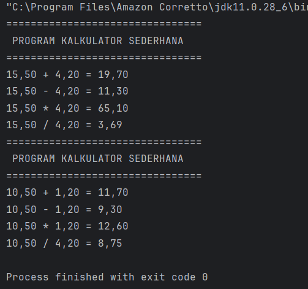
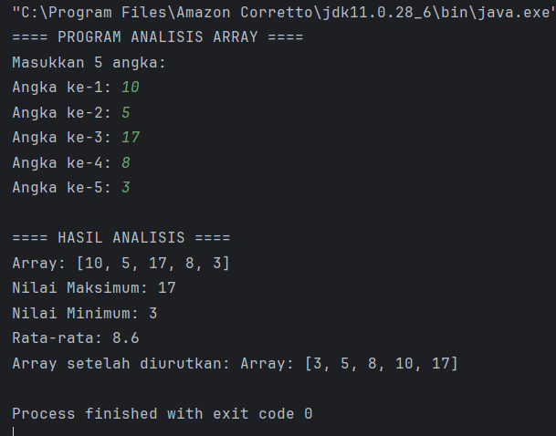
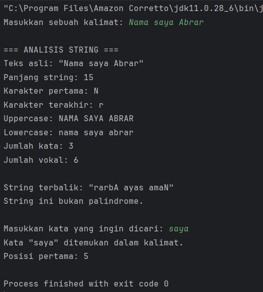
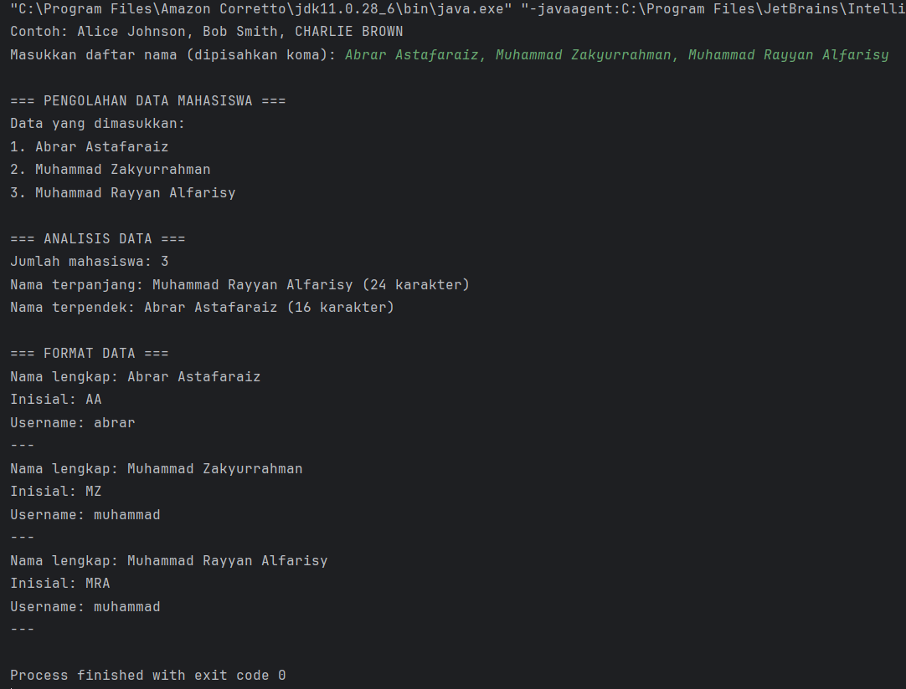

# Laporan Modul 2: Dasar Pemrograman Java Lanjutan
**Mata Kuliah:** Praktikum Pemrograman Berorientasi Objek   
**Nama:** Abrar Astafaraiz  
**NIM:** 2024573010088  
**Kelas:** TI 2A

---

## BAB I - PENDAHULUAN
&emsp;&emsp;Modul ini dirancang untuk memberikan pemahaman dasar tentang pemrograman Java melalui praktikum langsung. Setiap praktikum dilengkapi dengan teori dasar dan langkah-langkah implementasi yang detail.

### 1.1 Latar Belakang

&emsp;&emsp;Pemrograman Java merupakan salah satu bahasa pemrograman yang banyak digunakan dalam dunia pengembangan perangkat lunak karena memiliki sifat yang portable, object-oriented, dan mudah dipelajari. Pada tingkat dasar, mahasiswa diperkenalkan pada konsep-konsep fundamental seperti variabel, tipe data, operator, dan struktur kontrol. Namun, seiring perkembangan kebutuhan dalam dunia pemrograman, dibutuhkan pemahaman yang lebih mendalam mengenai fitur-fitur lanjutan seperti array, method, dan manipulasi string. Oleh karena itu, modul ini hadir untuk memperluas wawasan mahasiswa dalam mengimplementasikan konsep-konsep tersebut secara langsung melalui latihan praktikum.

&emsp;&emsp;Array merupakan salah satu struktur data penting dalam pemrograman karena memungkinkan penyimpanan beberapa nilai dengan tipe data yang sama secara efisien. Pemahaman tentang array, baik satu dimensi maupun dua dimensi, menjadi dasar untuk mengelola data dalam jumlah besar. Melalui praktikum ini, mahasiswa diajak untuk memahami bagaimana cara mendeklarasikan, menginisialisasi, mengakses, dan memproses data menggunakan array, serta mengembangkan kemampuan logika dalam menentukan nilai rata-rata, nilai tertinggi, dan nilai terendah dari sekumpulan data.

&emsp;&emsp;Selain itu, konsep method atau fungsi menjadi bagian penting dalam menulis program yang terstruktur dan efisien. Dengan menggunakan method, kode program dapat dibuat lebih modular, mudah dibaca, serta mudah diperbaiki ketika terjadi kesalahan. Praktikum mengenai method dalam modul ini dirancang agar mahasiswa mampu membuat, memanggil, dan mengelola berbagai jenis method, baik yang bersifat static maupun non-static, dengan atau tanpa nilai balik. Materi ini juga melatih kemampuan berpikir sistematis dalam memecah suatu masalah menjadi bagian-bagian kecil yang dapat diselesaikan secara bertahap.

&emsp;&emsp;Selanjutnya, mahasiswa juga diperkenalkan dengan materi mengenai string dan berbagai metode manipulasi teks di Java. Pengolahan string sangat dibutuhkan dalam banyak aplikasi, seperti pemrosesan data pengguna, pembuatan format teks, dan validasi input. Dalam praktikum ini, mahasiswa akan belajar bagaimana menggunakan berbagai method bawaan Java seperti substring(), replace(), dan toUpperCase() untuk mengubah atau memeriksa isi string. Dengan demikian, mahasiswa diharapkan tidak hanya memahami teori pemrograman, tetapi juga mampu menerapkannya dalam konteks nyata seperti pengolahan data dan pembuatan aplikasi sederhana.

### 1.2 Tujuan Penulisan

&emsp;&emsp;
Tujuan penulisan laporan ini adalah untuk mendokumentasikan hasil pembelajaran dan implementasi dari praktikum Modul 3 “Dasar Pemrograman Java Lanjutan”, yang mencakup konsep penggunaan array satu dan dua dimensi, penerapan method dalam program, serta manipulasi string. Melalui laporan ini, mahasiswa diharapkan dapat memahami cara kerja setiap konsep secara praktis, meningkatkan kemampuan analisis logika pemrograman, serta mampu mengembangkan kode program Java yang efisien, terstruktur, dan mudah dipelihara.

---

## BAB II - PRAKTIKUM
### 2.1 Praktikum 1 - Array
#### Dasar Teori

&emsp;&emsp;Array adalah struktur data yang dapat menyimpan beberapa nilai dengan tipe data yang sama dalam satu variabel. Array menggunakan indeks untuk mengakses elemen-elemennya, dimulai dari indeks 0.

**Karakteristik Array :**

* Semua elemen memiliki tipe data yang sama
* Ukuran array bersifat tetap (fixed size)
* Indeks dimulai dari 0
* Elemen dapat diakses secara langsung menggunakan indeks

**Syntax Array :**

```declarative
// Deklarasi array
tipeData[] namaArray = new tipeData[ukuran];

// Atau inisialisasi langsung
tipeData[] namaArray = {nilai1, nilai2, nilai3, ...};

```

### 2.1.1 Praktikum 1.1 - Array Satu Dimensi

Memahami cara mendeklarasikan, menginisialisasi, dan mengakses array satu dimensi.

#### 2.1.1.1 Langkah Praktikum
1. Buat file baru dengan nama ArraySatuDimensi.java
2. Ketik kode berikut:
```declarative
package modul_3;
public class ArraySatuDimensi {
    public static void main(String[] args) {
        //Sebelum Dimodifikasi
        // Langkah 1: Deklarasi dan inisialisasi array
        int[] nilai = {85, 90, 78, 92, 88};
        String[] nama = {"Alice", "Bob", "Charlie", "Diana", "Eva"};

        // Langkah 2: Menampilkan panjang array
        System.out.println("Jumlah siswa: " + nilai.length);

        // Langkah 3: Mengakses elemen array
        System.out.println("Nama siswa pertama: " + nama[0]);

        // Langkah 4: Menampilkan semua data menggunakan loop
        System.out.println("\nData semua siswa:");
        for (int i = 0; i < nama.length; i++) {
            System.out.println((i + 1) + ". " + nama[i] + " - Nilai: " + nilai[i]);
        }
    }
}
```

#### 2.1.1.2 Screenshoot Hasil


#### 2.1.1.3 Kesimpulan Praktikum 1.1

📝 Kesimpulan

Pada praktikum ini, mahasiswa mempelajari cara mendeklarasikan, menginisialisasi, dan mengakses elemen-elemen array satu dimensi di Java. Melalui latihan, mahasiswa memahami bahwa array dapat menyimpan banyak nilai dengan tipe data yang sama dalam satu variabel, dan setiap elemen dapat diakses menggunakan indeks. Dari hasil praktikum, diperoleh bahwa penggunaan array mempermudah pengolahan data seperti menghitung rata-rata nilai serta menentukan nilai tertinggi dan terendah secara efisien tanpa harus menggunakan banyak variabel.

---

### 2.1.2 Praktikum 1.2 - Array Dua Dimensi

Memahami konsep dan penggunaan array dua dimensi (matriks).

#### 2.1.2.1 Langkah Praktikum

1. Buat file baru dengan nama ArrayDuaDimensi.java
2. Ketik kode berikut:
```declarative
package modul_3;
import java.util.Scanner;

public class ArrayDuaDimensi {
    public static void main(String[] args) {
        Scanner input = new Scanner(System.in);
        // Langkah 1: Deklarasi array 2D untuk nilai siswa (3 siswa, 4 mata pelajaran)
        int[][] nilaiSiswa = new int[3][4];
        String[] namaSiswa = new String[3];
        String[] mataPelajaran = {"Matematika", "Bahasa Indonesia", "IPA", "IPS"};

        // Langkah 2: Input nilai
        System.out.println("=== INPUT NILAI SISWA ===");
        for (int i = 0; i < 3; i++) {
            System.out.print("Nama siswa ke-" + (i + 1) + ": ");
            namaSiswa[i] = input.next();
            for (int j = 0; j < 4; j++) {
                System.out.print(mataPelajaran[j] + ": ");
                nilaiSiswa[i][j] = input.nextInt();
            }
            System.out.println();
        }

        // Langkah 3: Menampilkan data dalam bentuk tabel
        System.out.println("=== TABEL NILAI SISWA ===");
        System.out.printf("%-15s", "Nama");
        for (int i = 0; i < 4; i++) {
            // Mengambil 7 karakter pertama untuk header kolom
            System.out.printf("%-15s", mataPelajaran[i].substring(0, Math.min(7, mataPelajaran[i].length())));
        }
        System.out.printf("%-15s\n", "Rata-rata");

        for (int i = 0; i < 3; i++) {
            System.out.printf("%-15s", namaSiswa[i]);
            int total = 0;
            for (int j = 0; j < 4; j++) {
                System.out.printf("%-15d", nilaiSiswa[i][j]);
                total += nilaiSiswa[i][j];
            }
            double ratarata = total / 4.0;
            System.out.printf("%-15.2f\n", ratarata);
        }
    }
}
```

#### 2.1.2.2 Screenshoot Hasil


#### 2.1.2.3 Kesimpulan Praktikum 1.2
📝 Kesimpulan

Dalam praktikum ini, mahasiswa mengenal konsep array dua dimensi yang berfungsi untuk menyimpan data dalam bentuk tabel (baris dan kolom). Melalui implementasi program nilai siswa, mahasiswa belajar menginput data, menampilkannya dalam format tabel, serta menghitung rata-rata nilai setiap siswa. Dengan menambahkan fitur lanjutan, mahasiswa juga dapat menampilkan mata pelajaran dengan nilai tertinggi untuk setiap siswa serta menghitung rata-rata nilai tiap mata pelajaran. Praktikum ini menegaskan bahwa array dua dimensi sangat berguna dalam pengolahan data yang lebih kompleks seperti nilai siswa, data penjualan, atau matriks matematika.

---

### 2.2 Praktikum 2 - Method/Function

#### Dasar Teori

&emsp;&emsp;Method adalah blok kode yang dapat dipanggil untuk menjalankan tugas tertentu. Method memungkinkan kita untuk:

* Menghindari pengulangan kode
* Membuat program lebih terstruktur
* Memudahkan debugging dan maintenance

Jenis Method:
* Static Method: Dapat dipanggil tanpa membuat object
* Non-static Method: Perlu membuat object terlebih dahulu
* Void Method: Tidak mengembalikan nilai
* Return Method: Mengembalikan nilai

Syntax Method:
```declarative
java[access modifier] [static] returnType namaMethod(parameter) {
    // body method
    return value; // jika ada return type
}
```

### 2.2.1 Praktikum 2.1 - Method Dasar

Memahami cara membuat dan memanggil method dengan berbagai jenis parameter dan return type.

#### 2.2.1.1 Langkah Praktikum

1. Buat file baru dengan nama MethodDasar.java
2. Implementasikan kode berikut:
```declarative
package modul_3;
public class MethodDasar {
    // Sebelum Dimodifikasi
    // Langkah 1: Method void tanpa parameter
    public static void tampilkanHeader() {
        System.out.println("================================");
        System.out.println(" PROGRAM KALKULATOR SEDERHANA");
        System.out.println("================================");
    }

    // Langkah 2: Method void dengan parameter
    public static void tampilkanHasil(String operasi, double a, double b, double hasil) {
        System.out.printf("%.2f %s %.2f = %.2f%n", a, operasi, b, hasil);
    }

    // Langkah 3: Method dengan return value
    public static double tambah(double a, double b) {
        return a + b;
    }

    public static double kurang(double a, double b) {
        return a - b;
    }

    public static double kali(double a, double b) {
        return a * b;
    }

    public static double bagi(double a, double b) {
        if (b != 0) {
            return a / b;
        } else {
            System.out.println("Error: Pembagian dengan nol!");
            return 0;
        }
    }

    // Langkah 4: Method dengan validasi input
    public static boolean validasiAngka(double angka) {
        return !Double.isNaN(angka) && Double.isFinite(angka);
    }

    public static void main(String[] args) {
        // Langkah 5: Menggunakan semua method
        tampilkanHeader();
        double x = 15.5;
        double y = 4.2;

        if (validasiAngka(x) && validasiAngka(y)) {
            double hasilTambah = tambah(x, y);
            double hasilKurang = kurang(x, y);
            double hasilKali = kali(x, y);
            double hasilBagi = bagi(x, y);

            tampilkanHasil("+", x, y, hasilTambah);
            tampilkanHasil("-", x, y, hasilKurang);
            tampilkanHasil("*", x, y, hasilKali);
            tampilkanHasil("/", x, y, hasilBagi);
        }

        // Setelah Dimodifikasi (Perubahan Nilai Input)
        // Langkah 5: Menggunakan semua method
        tampilkanHeader();
        double v = 10.5; // Nilai diubah
        double w = 1.2;  // Nilai diubah

        if (validasiAngka(v) && validasiAngka(w)) {
            double hasilTambah = tambah(v, w);
            double hasilKurang = kurang(v, w);
            double hasilKali = kali(v, w);
            double hasilBagi = bagi(v, w);

            tampilkanHasil("+", v, w, hasilTambah);
            tampilkanHasil("-", v, w, hasilKurang);
            tampilkanHasil("*", v, w, hasilKali);
            tampilkanHasil("/", v, y, hasilBagi);
        }
    }
}
```


#### 2.2.1.2 Screenshoot Hasil
 


#### 2.2.1.3 Kesimpulan Praktikum 2.1

📝 Kesimpulan

Praktikum ini memberikan pemahaman tentang cara membuat dan menggunakan method di Java. Mahasiswa belajar membedakan antara method void dan return, serta memahami pentingnya parameter dalam mengirim data antar bagian program. Selain itu, mahasiswa juga menambahkan method baru seperti operasi pangkat, akar kuadrat, dan validasi pembagian dengan nol. Dari hasil praktikum, dapat disimpulkan bahwa penggunaan method membuat kode program lebih terstruktur, mudah dipahami, serta mengurangi pengulangan kode yang sama di berbagai bagian program.

---

### 2.2.2 Praktikum 2.2 - Method Dengan Array

Memahami cara menggunakan method untuk memproses array.

#### 2.2.2.1 Langkah Praktikum
1. Buat file baru dengan nama ArrayMethod.java
2. Implementasikan berbagai contoh for loop:
```declarative
package modul_3;
import java.util.Scanner;

public class ArrayMethod {

    // Method untuk input array
    public static int[] inputArray(int ukuran) {
        Scanner input = new Scanner(System.in);
        int[] array = new int[ukuran];
        System.out.println("Masukkan " + ukuran + " angka:");
        for (int i = 0; i < ukuran; i++) {
            System.out.print("Angka ke-" + (i + 1) + ": ");
            array[i] = input.nextInt();
        }
        return array;
    }

    // Method untuk menampilkan array
    public static void tampilkanArray(int[] array) {
        System.out.print("Array: [");
        for (int i = 0; i < array.length; i++) {
            System.out.print(array[i]);
            if (i < array.length - 1) {
                System.out.print(", ");
            }
            System.out.println("]");
        }

        // Method untuk mencari nilai maksimum (Dikonstruksi berdasarkan potongan dan fungsi)
        public static int cariMaksimum(int[] array) {
            int maks = array[0];
            for (int i = 1; i < array.length; i++) {
                if (array[i] > maks) {
                    maks = array[i];
                }
            }
            return maks;
        }

        // Method untuk mencari nilai minimum (Dikonstruksi berdasarkan deskripsi praktikum)
        public static int cariMinimum(int[] array) {
            int min = array[0];
            for (int i = 1; i < array.length; i++) {
                if (array[i] < min) {
                    min = array[i];
                }
            }
            return min;
        }

        // Method untuk menghitung rata-rata (Dikonstruksi berdasarkan potongan)
        public static double hitungRataRata(int[] array) {
            int total = 0;
            for (int nilai : array) {
                total += nilai;
            }
            return (double) total / array.length;
        }

        // Method untuk mengurutkan array (Bubble Sort)
        public static int[] urutkanArray(int[] array) {
            int[] arrayBaru = array.clone(); // Membuat copy array
            for (int i = 0; i < arrayBaru.length - 1; i++) {
                for (int j = 0; j < arrayBaru.length - 1 - i; j++) {
                    if (arrayBaru[j] > arrayBaru[j + 1]) {
                        // Tukar posisi
                        int temp = arrayBaru[j];
                        arrayBaru[j] = arrayBaru[j + 1];
                        arrayBaru[j + 1] = temp;
                    }
                }
            }
            return arrayBaru;
        }

        public static void main(String[] args) {
            System.out.println("==== PROGRAM ANALISIS ARRAY ====");
            int[] data = inputArray(5);

            System.out.println("\n==== HASIL ANALISIS ====");
            tampilkanArray(data);
            System.out.println("Nilai Maksimum: " + cariMaksimum(data));
            System.out.println("Nilai Minimum: " + cariMinimum(data));
            System.out.println("Rata-rata: " + hitungRataRata(data));

            int[] dataTerurut = urutkanArray(data);
            System.out.print("Array setelah diurutkan: ");
            tampilkanArray(dataTerurut);
        }
    }
}
```

#### 2.2.2.2 Screenshoot Hasil
 


#### 2.2.2.3 Kesimpulan Praktikum 2.2

📝 Kesimpulan

Pada praktikum ini, mahasiswa menerapkan konsep method untuk memproses data array. Mahasiswa mempelajari bagaimana array dapat dikirim sebagai parameter ke dalam method dan diproses di sana, seperti mencari nilai tertentu dan menghitung median dari array yang telah diurutkan. Dari praktikum ini, mahasiswa memahami pentingnya kombinasi antara method dan array untuk memecahkan masalah yang melibatkan banyak data secara sistematis. Hasilnya, mahasiswa dapat menulis kode yang modular, efisien, dan mudah diperluas.

---

### 2.3 Praktikum 3 - String dan Manipulasi String

#### Dasar Teori

&emsp;&emsp;String adalah tipe data yang menyimpan rangkaian karakter. Di Java, String adalah object yang memiliki banyak method built-in untuk manipulasi teks.

**Karakteristik String di Java:**

* String bersifat immutable (tidak dapat diubah)
* Setiap operasi String menghasilkan String baru
* Java menyediakan banyak method untuk manipulasi String

Method String yang Penting:
* Slength(): mendapatkan panjang string
* charAt(): mendapatkan karakter pada indeks tertentu
* substring(): mengambil bagian string
* toLowerCase() / toUpperCase(): mengubah case
* contains(): mengecek apakah string mengandung substring
* replace(): mengganti karakter/substring

### 2.3.1 Praktikum 3.1 - Manipulasi String Dasar

Memahami berbagai method manipulasi string dan penggunaannya.

#### 2.3.1.1 Langkah Praktikum

1. Buat file baru dengan nama StringDasar.java
2. Implementasikan kode berikut:
```declarative
package modul_3;
import java.util.Scanner;

public class StringDasar {

    public static void analisisString(String teks) {
        System.out.println("\n=== ANALISIS STRING ===");
        System.out.println("Teks asli: \"" + teks + "\"");
        System.out.println("Panjang string: " + teks.length());
        System.out.println("Karakter pertama: " + teks.charAt(0));
        System.out.println("Karakter terakhir: " + teks.charAt(teks.length() - 1));
        System.out.println("Uppercase: " + teks.toUpperCase());
        System.out.println("Lowercase: " + teks.toLowerCase());

        // Menghitung jumlah kata
        String[] kata = teks.trim().split("\\s+");
        System.out.println("Jumlah kata: " + kata.length);

        // Menghitung jumlah vokal
        int jumlahVokal = hitungVokal(teks);
        System.out.println("Jumlah vokal: " + jumlahVokal);
        // Method hitungKonsonan() seharusnya dipanggil di sini juga
    }

    public static int hitungVokal(String teks) {
        String vokal = "aeiouAEIOU";
        int count = 0;
        for (int i = 0; i < teks.length(); i++) {
            // Logika disimpulkan dari fungsionalitas
            if (vokal.contains(String.valueOf(teks.charAt(i)))) {
                count++;
            }
        }
        return count;
    }

    // Method untuk membalik string (Dikonstruksi)
    public static String reverseString(String teks) {
        return new StringBuilder(teks).reverse().toString();
    }

    // Method untuk cek palindrome (Dikonstruksi)
    public static boolean isPalindrome(String teks) {
        // Membersihkan string dari spasi/simbol dan mengubah ke lowercase untuk perbandingan
        String cleanTeks = teks.replaceAll("[^a-zA-Z0-9]", "").toLowerCase();
        String reversed = new StringBuilder(cleanTeks).reverse().toString();
        return cleanTeks.equals(reversed);
    }

    public static void main(String[] args) {
        Scanner input = new Scanner(System.in);
        System.out.print("Masukkan sebuah kalimat: ");
        String kalimat = input.nextLine();

        // Analisis dasar
        analisisString(kalimat);

        // String terbalik
        System.out.println("\nString terbalik: \"" + reverseString(kalimat) + "\"");

        // Cek palindrome
        if (isPalindrome(kalimat)) {
            System.out.println("String ini adalah palindrome!");
        } else {
            System.out.println("String ini bukan palindrome.");
        }

        // Pencarian substring
        System.out.print("\nMasukkan kata yang ingin dicari: ");
        String cari = input.nextLine();

        if (kalimat.toLowerCase().contains(cari.toLowerCase())) {
            System.out.println("Kata \"" + cari + "\" ditemukan dalam kalimat.");
            int posisi = kalimat.toLowerCase().indexOf(cari.toLowerCase());
            System.out.println("Posisi pertama: " + posisi);
        } else {
            System.out.println("Kata \"" + cari + "\" tidak ditemukan dalam kalimat.");
        }
    }
}
```


#### 2.3.1.2 Screenshoot Hasil



#### 2.3.1.3 Kesimpulan Praktikum 3.1

📝 Kesimpulan

Praktikum ini bertujuan untuk melatih kemampuan mahasiswa dalam mengolah teks menggunakan berbagai method bawaan pada kelas String di Java. Mahasiswa mencoba operasi seperti menghitung panjang string, mengambil sebagian teks dengan substring(), mengubah huruf menjadi besar atau kecil, serta memeriksa apakah teks merupakan palindrome. Selain itu, mahasiswa juga menambahkan fitur tambahan untuk menghitung jumlah konsonan dan mengubah teks menjadi format Pascal Case. Dari praktikum ini, mahasiswa memahami bahwa manipulasi string sangat penting untuk pengolahan data teks dalam berbagai aplikasi.

---

### 2.3.2 Praktikum 3.2 - Method Dengan Array

Memahami penggunaan string untuk pengolahan data dalam format teks.

#### 2.3.2.1 Langkah Praktikum
1. Buat file baru dengan nama TextProcessing.java
2. Implementasikan berbagai contoh for loop:
```declarative
package modul_3;
import java.util.Scanner;

public class TextProcessing {

    public static void prosesDataMahasiswa(String data) {
        System.out.println("\n=== PENGOLAHAN DATA MAHASISWA ===");
        // Memisahkan data berdasarkan koma
        String[] dataMahasiswa = data.split(",");

        System.out.println("Data yang dimasukkan:");
            for (int i = 0; i < dataMahasiswa.length; i++) {
                dataMahasiswa[i] = dataMahasiswa[i].trim(); // Menghilangkan spasi
                System.out.println((i + 1) + ". " + dataMahasiswa[i]);
            }

            // Analisis data
            System.out.println("\n=== ANALISIS DATA ===");
            System.out.println("Jumlah mahasiswa: " + dataMahasiswa.length);

            // Mencari nama terpanjang dan terpendek
            String namaTerpanjang = dataMahasiswa[0];
            String namaTerpendek = dataMahasiswa[0];

            for (String nama : dataMahasiswa) {
                if (nama.length() > namaTerpanjang.length()) {
                    namaTerpanjang = nama;
                }
                if (nama.length() < namaTerpendek.length()) {
                    namaTerpendek = nama;
                }
            }
            // Output Analisis (Dikonstruksi berdasarkan hasil screenshot)
            System.out.println("Nama terpanjang: " + namaTerpanjang + " (" + namaTerpanjang.length() + " karakter)");
            System.out.println("Nama terpendek: " + namaTerpendek + " (" + namaTerpendek.length() + " karakter)");

            System.out.println("\n=== FORMAT DATA ===");
            for (String nama : dataMahasiswa) {
                String namaFormatted = formatTitleCase(nama);
                String inisial = buatInisial(namaFormatted);

                System.out.println("Nama lengkap: " + namaFormatted);
                System.out.println("Inisial: " + inisial);
                System.out.println("Username: " + buatUsername(namaFormatted));
                System.out.println("---");
            }
    }

    public static String formatTitleCase(String teks) {
        String[] kata = teks.toLowerCase().split(" ");
        StringBuilder result = new StringBuilder();

        for (String k : kata) {
            if (k.length() > 0) {
                result.append(Character.toUpperCase(k.charAt(0)))
                .append(k.substring(1))
                .append(" ");
            }
        }       
        return result.toString().trim();
    }

    public static String buatInisial(String nama) {
        String[] kata = nama.split(" ");
        StringBuilder inisial = new StringBuilder();

        for (String k : kata) {
            if (k.length() > 0) {
                inisial.append(Character.toUpperCase(k.charAt(0)));
            }
        }
        return inisial.toString();
    }

    // Method untuk membuat username (Dikonstruksi berdasarkan hasil screenshot)
    public static String buatUsername(String nama) {
        // Mengambil kata pertama dan mengubahnya menjadi huruf kecil
        String[] kata = nama.split(" ");
        return kata[0].toLowerCase();
    }

    public static void main(String[] args) {
        Scanner input = new Scanner(System.in);
        System.out.println("Contoh: Alice Johnson, Bob Smith, CHARLIE BROWN");
        System.out.print("Masukkan daftar nama (dipisahkan koma): ");
        String dataInput = input.nextLine();
        prosesDataMahasiswa(dataInput);
    }
}
```

#### 2.3.2.2 Screenshoot Hasil



#### 2.3.2.3 Kesimpulan Praktikum 3.2

📝 Kesimpulan

Dalam praktikum terakhir ini, mahasiswa belajar bagaimana string dapat digunakan untuk mengolah data dalam format teks yang lebih nyata, seperti nama pengguna atau data profil. Mahasiswa membuat program untuk memproses nama, menghasilkan alamat email secara otomatis, dan memvalidasi input agar tidak mengandung angka atau karakter khusus. Melalui latihan ini, mahasiswa memahami bagaimana pemrosesan string dapat diterapkan untuk kebutuhan dunia nyata seperti pembuatan sistem pendaftaran atau pengolahan data pengguna dalam aplikasi.

---

## BAB III - PENUTUP

### 3.1 Kesimpulan

&emsp;&emsp;Dari seluruh rangkaian praktikum pada Modul 3 “Dasar Pemrograman Java Lanjutan”, dapat disimpulkan bahwa kegiatan ini memberikan pemahaman yang lebih mendalam mengenai konsep dasar hingga lanjutan dalam pemrograman Java. Mahasiswa tidak hanya mempelajari teori, tetapi juga menerapkannya secara langsung melalui berbagai latihan yang melibatkan penggunaan array, method, dan manipulasi string. Melalui penerapan praktis tersebut, mahasiswa belajar menyusun program yang lebih terstruktur, efisien, dan mampu menyelesaikan permasalahan dengan logika pemrograman yang baik.

&emsp;&emsp;Pada bagian materi array, mahasiswa memahami bagaimana cara menyimpan dan mengelola sejumlah data yang memiliki tipe data sama menggunakan array satu dimensi maupun dua dimensi. Konsep ini membantu mahasiswa dalam menyusun program yang mampu mengolah data dalam jumlah besar dengan lebih sederhana dan sistematis. Selain itu, mahasiswa juga berlatih untuk melakukan berbagai operasi seperti menghitung rata-rata, mencari nilai tertinggi dan terendah, serta menampilkan hasil dalam bentuk tabel. Pemahaman ini menjadi dasar penting dalam pengembangan aplikasi yang berhubungan dengan pengolahan data numerik maupun tabel.

&emsp;&emsp;Selanjutnya, pada materi tentang method, mahasiswa mempelajari bagaimana membuat blok kode yang dapat digunakan berulang untuk menjalankan tugas tertentu. Penerapan method memungkinkan program lebih modular dan mudah dibaca, sekaligus menghindari pengulangan kode. Melalui praktikum ini, mahasiswa juga mengenal berbagai jenis method, baik yang bersifat void maupun return, serta cara menggunakannya dalam operasi matematika dan pemrosesan array. Dengan memahami konsep method, mahasiswa dapat membangun struktur program yang rapi dan efisien dalam menangani berbagai fungsi secara terpisah.

&emsp;&emsp;Terakhir, pada bagian manipulasi string, mahasiswa dibekali dengan kemampuan untuk mengolah data berbentuk teks menggunakan berbagai method bawaan dari kelas String. Melalui latihan ini, mahasiswa dapat memahami bagaimana melakukan perubahan format teks, validasi input, serta pembuatan data dinamis seperti alamat email. Keseluruhan modul ini secara menyeluruh meningkatkan kemampuan mahasiswa dalam berpikir logis, memahami struktur data, dan menerapkan prinsip-prinsip pemrograman berorientasi objek. Dengan demikian, mahasiswa menjadi lebih siap dalam mengembangkan program yang lebih kompleks pada tingkat selanjutnya.

---

## BAB IV - REFERENSI
Modul Praktikum 3 by Pak Muhammad Reza Zulman, S.ST., M.Sc.
* https://hackmd.io/@mohdrzu/BJBWepc3xg

Web W3Schools bagian Java
* https://www.w3schools.com/java/default.asp