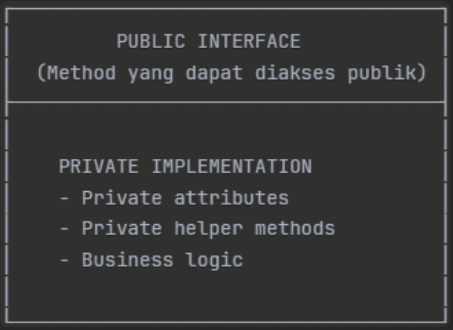
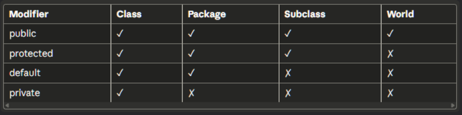
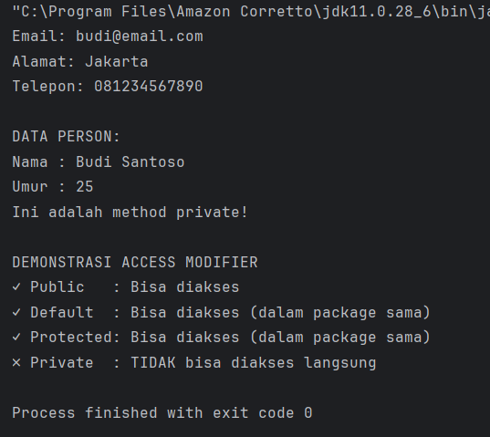
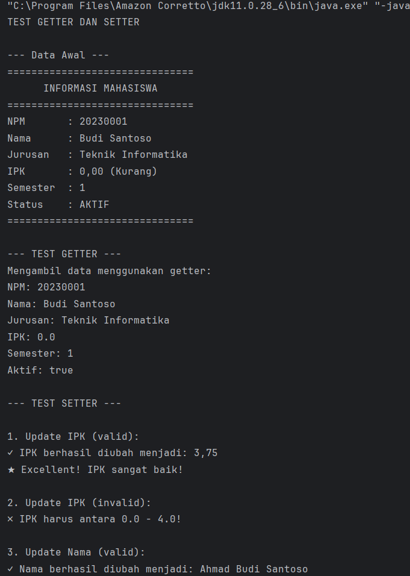
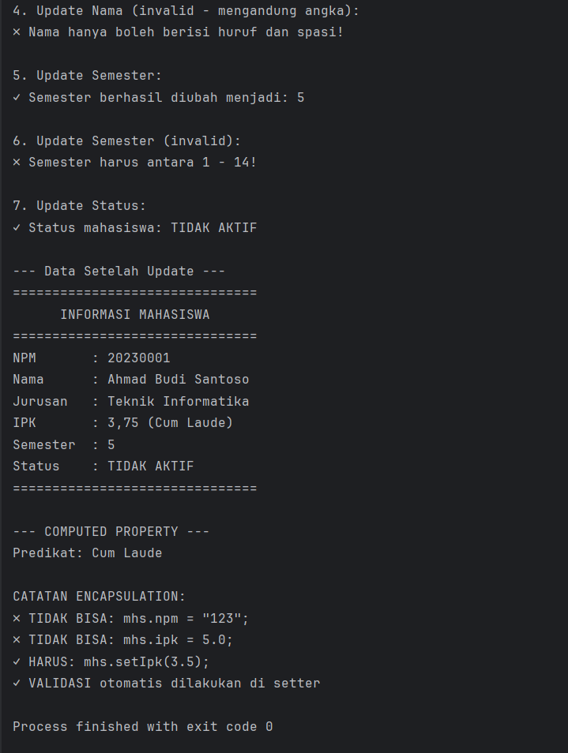
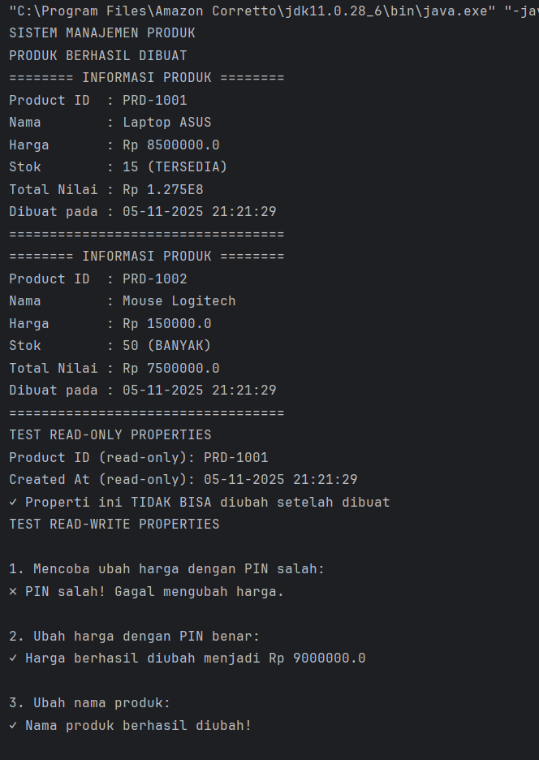
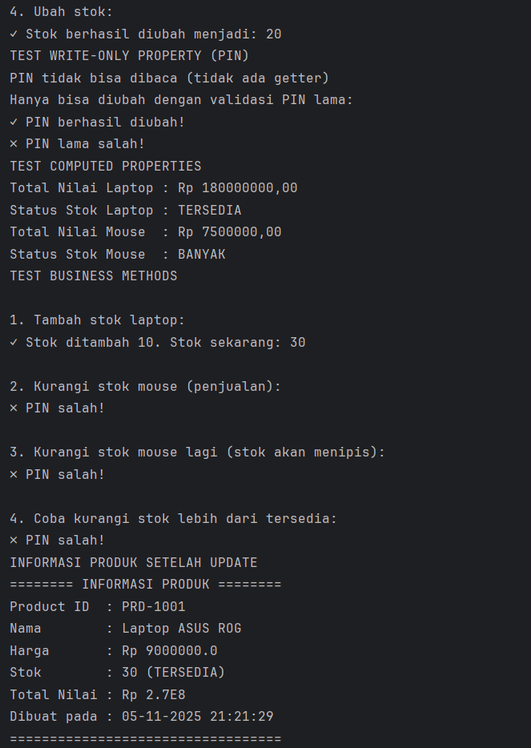
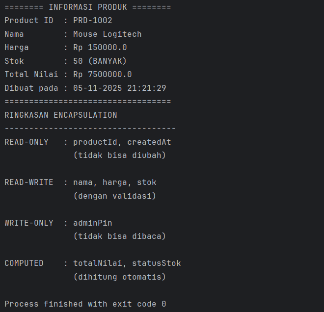

# Laporan Modul 5: Enkapsulasi
**Mata Kuliah:** Praktikum Pemrograman Berorientasi Objek   
**Nama:** Abrar Astafaraiz  
**NIM:** 2024573010088  
**Kelas:** TI 2A

---

## BAB I - PENDAHULUAN

### 1.1 Latar Belakang

&emsp;&emsp;Encapsulation (Enkapsulasi) adalah salah satu prinsip fundamental dalam Object-Oriented Programming (OOP) yang membungkus data (attributes) dan method yang bekerja pada data tersebut dalam satu unit (class), serta menyembunyikan detail implementasi internal dari dunia luar.

### 1.2 Tujuan Enkapsulasi

1. Data Protection - Melindungi data dari akses dan modifikasi yang tidak sah.
2. Data Validation - Memastikan data yang masuk valid sebelum disimpan.
3. Flexibility - Mudah mengubah implementasi internal tanpa mempengaruhi kode luar.
4. Maintainability - Kode lebih mudah dipelihara dan di-debug.
5. Modularity - Membuat kode lebih modular dan terorganisir

### 1.3 Prinsip Utama



### 1.4 Cara Implementasi

1. Deklarasikan attributes sebagai private.
2. Buat getter methods untuk membaca nilai attributes.
3. Buat setter methods untuk mengubah nilai attributes dengan validasi.
4. Tambahkan business logic di dalam class.

### 1.5 Access Modifier

&emsp;&emsp;Access modifier menentukan tingkat akses terhadap class, attributes, dan methods. Java memiliki 4 jenis access modifier:



---

## BAB II - PRAKTIKUM
### 2.1 Praktikum 1 - Memahami Access Modifier
#### 2.1.1 Tujuan

&emsp;&emsp;Memahami perbedaan dan penggunaan berbagai access modifier.

#### 2.1.2 Langkah Praktikum
1. Buat sebuah package baru di dalam package `modul_5` dengan nama `praktikum_1`
2. Buat class baru bernama `Person` dengan berbagai access modifier
```declarative
package Modul_5.praktikum_1;

public class Person {
    // Private (hanya bisa diakses dalam class ini)
    private String nama;
    private int umur;

    // Default (bisa diakses dalam package yang sama)
    String alamat;

    // Protected (bisa diakses dalam package yang sama atau subclass)
    protected String telepon;

    // Public (bisa diakses dari mana saja)
    public String email;

    // Constructor
    public Person(String nama, int umur) {
        this.nama = nama;
        this.umur = umur;
    }

    // Public method untuk menampilkan data private
    public void tampilkanInfo() {
        System.out.println("\nDATA PERSON:");
        System.out.println("Nama : " + nama);
        System.out.println("Umur : " + umur);
    }

    // Private method (hanya bisa dipanggil di dalam class)
    private void metodePribadi() {
        System.out.println("Ini adalah method private!");
    }

    // Public method untuk memanggil method private
    public void panggilMetodePribadi() {
        metodePribadi();
    }
}
```

3. Buat class `AccessModifierTest` untuk testing:
```declarative
package Modul_5.praktikum_1;

public class AccessModifierTest {
    public static void main(String[] args) {
        Person person = new Person("Budi Santoso", 25);

        // Test akses public
        person.email = "budi@email.com";  // OK - public
        System.out.println("Email: " + person.email);

        // Test akses default (dalam package yang sama)
        person.alamat = "Jakarta";        // OK - dalam package yang sama
        System.out.println("Alamat: " + person.alamat);

        // Test akses protected (dalam package yang sama)
        person.telepon = "081234567890";  // OK - dalam package yang sama
        System.out.println("Telepon: " + person.telepon);

        // Test akses private - AKAN ERROR jika uncomment
        // person.nama = "Andi";          // ERROR - private
        // person.umur = 30;              // ERROR - private
        // person.metodePribadi();        // ERROR - private

        // Mengakses data private melalui public method
        person.tampilkanInfo();

        // Mengakses private method melalui public method
        person.panggilMetodePribadi();

        System.out.println("\nDEMONSTRASI ACCESS MODIFIER");
        System.out.println("✓ Public   : Bisa diakses");
        System.out.println("✓ Default  : Bisa diakses (dalam package sama)");
        System.out.println("✓ Protected: Bisa diakses (dalam package sama)");
        System.out.println("✗ Private  : TIDAK bisa diakses langsung");
    }
}
```

4. Jalankan program dan amati hasilnya
5. Coba uncomment baris yang mengakses private members dan lihat error yang terjadi

#### 2.1.3 Hasil Praktikum



### 2.2 Praktikum 2 - Getter dan Setter
#### 2.2.1 Teori Dasar

&emsp;&emsp;Getter dan Setter adalah method yang digunakan untuk mengakses dan mengubah nilai private attributes.

##### 2.2.1.1 Naming Convention

1. Getter: get + NamaAttribute (contoh: getNama())
2. Setter: set + NamaAttribute (contoh: setNama())
3. Boolean Getter: is + NamaAttribute (contoh: isActive())

#### 2.2.1.2 Keuntungan Menggunakan Getter/Setter:

* Kontrol akses terhadap data
* Validasi data sebelum disimpan
* Read-only atau write-only attributes
* Computed attributes 
* Lazy initialization

#### 2.2.2 Tujuan

&emsp;&emsp;Memahami cara membuat dan menggunakan getter dan setter dengan benar.

#### 2.2.3 Langkah Praktikum

1. Buat sebuah package baru di dalam package `modul_5` dengan nama `praktikum_2`
2. Buat class `Mahasiswa` dengan getter dan setter lengkap
```declarative
package Modul_5.praktikum_2;

public class Mahasiswa {
    // Private attributes
    private String npm;
    private String nama;
    private String jurusan;
    private double ipk;
    private int semester;
    private boolean aktif;
    
    // Constructor
    public Mahasiswa(String npm, String nama, String jurusan) {
        this.npm = npm;
        this.nama = nama;
        this.jurusan = jurusan;
        this.ipk = 0.0;
        this.semester = 1;
        this.aktif = true;
    }
    
    // GETTER METHODS
    public String getNpm() {
        return npm;
    }
    
    public String getNama() {
        return nama;
    }
    
    public String getJurusan() {
        return jurusan;
    }
    
    public double getIpk() {
        return ipk;
    }
    
    public int getSemester() {
        return semester;
    }
    
    // Boolean getter menggunakan 'is' prefix
    public boolean isAktif() {
        return aktif;
    }
    
    // SETTER METHODS DENGAN VALIDASI
    
    // NPM: Read-only (tidak ada setter)
    // Alasan: NPM tidak boleh diubah setelah dibuat
    public void setNama(String nama) {
        // Validasi: Nama tidak boleh kosong
        if (nama == null || nama.trim().isEmpty()) {
            System.out.println("✗ Nama tidak boleh kosong!");
            return;
        }
        
        // Validasi: Nama hanya huruf dan spasi
        if (!nama.matches("[a-zA-Z ]+")) {
            System.out.println("✗ Nama hanya boleh berisi huruf dan spasi!");
            return;
        }
        
        this.nama = nama;
        System.out.println("✓ Nama berhasil diubah menjadi: " + nama);
    }
    
    public void setJurusan(String jurusan) {
        if (jurusan == null || jurusan.trim().isEmpty()) {
            System.out.println("✗ Jurusan tidak boleh kosong!");
            return;
        }
        
        this.jurusan = jurusan;
        System.out.println("✓ Jurusan berhasil diubah menjadi: " + jurusan);
    }
    
    public void setIpk(double ipk) {
        // Validasi: IPK antara 0.0 - 4.0
        if (ipk < 0.0 || ipk > 4.0) {
            System.out.println("✗ IPK harus antara 0.0 - 4.0!");
            return;
        }
    
        this.ipk = ipk;
        System.out.printf("✓ IPK berhasil diubah menjadi: %.2f\n", ipk);
        
        // Cek status akademik berdasarkan IPK
        cekStatusAkademik();
    }
    
    public void setSemester(int semester) {
        // Validasi: Semester antara 1 - 14
        if (semester < 1 || semester > 14) {
            System.out.println("✗ Semester harus antara 1 - 14!");
            return;
        }
        
        this.semester = semester;
        System.out.println("✓ Semester berhasil diubah menjadi: " + semester);
    }
    
    public void setAktif(boolean aktif) {
        this.aktif = aktif;
        String status = aktif ? "AKTIF" : "TIDAK AKTIF";
        System.out.println("✓ Status mahasiswa: " + status);
    }
    
    // HELPER METHODS (PRIVATE)
    private void cekStatusAkademik() {
        if (ipk < 2.0) {
            System.out.println("⚠ Peringatan: IPK di bawah standar!");
        } else if (ipk > 3.5) {
            System.out.println("★ Excellent! IPK sangat baik!");
        }
    }
    
    // PUBLIC METHODS
    public String getPredikat() {
        if (ipk >= 3.5) return "Cum Laude";
        else if (ipk >= 3.0) return "Sangat Baik";
        else if (ipk >= 2.5) return "Baik";
        else if (ipk >= 2.0) return "Cukup";
        else return "Kurang";
    }
    
    public void tampilkanInfo() {
        System.out.println("===============================");
        System.out.println("      INFORMASI MAHASISWA      ");
        System.out.println("===============================");
        System.out.println("NPM       : " + npm);
        System.out.println("Nama      : " + nama);
        System.out.println("Jurusan   : " + jurusan);
        System.out.printf("IPK       : %.2f (%s)\n", ipk, getPredikat());
        System.out.println("Semester  : " + semester);
        System.out.println("Status    : " + (aktif ? "AKTIF" : "TIDAK AKTIF"));
        System.out.println("===============================");
    }
}


```

3. Buat class `GetterSetterTest`:
```declarative
package Modul_5.praktikum_2;

public class GetterSetterTest {
    public static void main(String[] args) {
        System.out.println("TEST GETTER DAN SETTER\n");

        // Membuat object mahasiswa
        Mahasiswa mhs = new Mahasiswa("20230001", "Budi Santoso", "Teknik Informatika");

        System.out.println("--- Data Awal ---");
        mhs.tampilkanInfo();

        // Test GETTER
        System.out.println("\n--- TEST GETTER ---");
        System.out.println("Mengambil data menggunakan getter:");
        System.out.println("NPM: " + mhs.getNpm());
        System.out.println("Nama: " + mhs.getNama());
        System.out.println("Jurusan: " + mhs.getJurusan());
        System.out.println("IPK: " + mhs.getIpk());
        System.out.println("Semester: " + mhs.getSemester());
        System.out.println("Aktif: " + mhs.isAktif());

        // Test SETTER dengan validasi
        System.out.println("\n--- TEST SETTER ---");

        // Test 1: Update IPK valid
        System.out.println("\n1. Update IPK (valid):");
        mhs.setIpk(3.75);

        // Test 2: Update IPK invalid
        System.out.println("\n2. Update IPK (invalid):");
        mhs.setIpk(5.0); // Akan ditolak

        // Test 3: Update nama valid
        System.out.println("\n3. Update Nama (valid):");
        mhs.setNama("Ahmad Budi Santoso");

        // Test 4: Update nama invalid
        System.out.println("\n4. Update Nama (invalid - mengandung angka):");
        mhs.setNama("Budi1123"); // Akan ditolak

        // Test 5: Update semester
        System.out.println("\n5. Update Semester:");
        mhs.setSemester(5);

        // Test 6: Update semester invalid
        System.out.println("\n6. Update Semester (invalid):");
        mhs.setSemester(20); // Akan ditolak

        // Test 7: Update status
        System.out.println("\n7. Update Status:");
        mhs.setAktif(false);

        // Tampilkan data akhir
        System.out.println("\n--- Data Setelah Update ---");
        mhs.tampilkanInfo();

        // Demonstrasi computed property
        System.out.println("\n--- COMPUTED PROPERTY ---");
        System.out.println("Predikat: " + mhs.getPredikat());

        // Tidak bisa akses langsung (akan error)
        System.out.println("\nCATATAN ENCAPSULATION:");
        System.out.println("✗ TIDAK BISA: mhs.npm = \"123\";");
        System.out.println("✗ TIDAK BISA: mhs.ipk = 5.0;");
        System.out.println("✓ HARUS: mhs.setIpk(3.5);");
        System.out.println("✓ VALIDASI otomatis dilakukan di setter");
    }
}
```

4. Jalankan program dan amati:
* Getter berfungsi untuk membaca data
* Setter melakukan validasi sebelum mengubah data
* Beberapa attribute bersifat read-only (tidak ada setter)

#### 2.2.4 Screenshoot Hasil




### 2.3 Praktikum 3 - Read-Only dan Write-Only Properties
#### 2.3.1 Tujuan

Memahami konsep read-only dan write-only properties menggunakan getter/setter.

#### 2.3.2 Langkah Praktikum
1. Buat sebuah package baru di dalam package `modul_5` dengan nama `praktikum_3`
   2. Buat class `Product` dengan berbagai jenis properties:
```declarative
package Modul_5.praktikum_3;

import java.time.LocalDateTime;
import java.time.format.DateTimeFormatter;

public class Product {
    // Read-only (hanya getter)
    private final String productId;
    private final LocalDateTime createdAt;
    
    // Read-write (getter dan setter)
    private String nama;
    private double harga;
    private int stok;
    
    // Write-only (hanya setter) - untuk password/PIN
    private String adminPin;
    
    // Computed property (tidak ada atribut, hanya getter)
    // Total nilai = harga * stok
    
    // Counter untuk ID otomatis
    private static int counter = 1000;
    
    // CONSTRUCTOR
    public Product(String nama, double harga, int stok, String adminPin) {
        this.productId = generateProductId();
        this.createdAt = LocalDateTime.now();
        this.nama = nama;
        this.harga = harga;
        this.stok = stok;
        this.adminPin = adminPin;
    }
    
    // PRIVATE HELPER METHODS
    private String generateProductId() {
        counter++;
        return "PRD-" + counter;
    }
    
    private boolean validatePin(String inputPin) {
        return this.adminPin.equals(inputPin);
    }
    
    // READ-ONLY PROPERTIES (hanya getter)
    public String getProductId() {
        return productId;
    }
    
    public String getCreatedAt() {
        DateTimeFormatter formatter = DateTimeFormatter.ofPattern("dd-MM-yyyy HH:mm:ss");
        return createdAt.format(formatter);
    }
    
    // READ-WRITE PROPERTIES (getter dan setter)
    public String getNama() {
        return nama;
    }
    
    public void setNama(String nama, String pin) {
        if (!validatePin(pin)) {
            System.out.println("✗ PIN salah! Gagal mengubah nama.");
            return;
        }
    
        if (nama == null || nama.trim().isEmpty()) {
            System.out.println("✗ Nama produk tidak boleh kosong!");
            return;
        }
    
        this.nama = nama;
        System.out.println("✓ Nama produk berhasil diubah!");
    }
    
    public double getHarga() {
        return harga;
    }
    
    public void setHarga(double harga, String pin) {
        if (!validatePin(pin)) {
            System.out.println("✗ PIN salah! Gagal mengubah harga.");
            return;
        }
    
        if (harga < 0) {
            System.out.println("✗ Harga tidak boleh negatif!");
            return;
        }
    
        this.harga = harga;
        System.out.println("✓ Harga berhasil diubah menjadi Rp " + harga);
    }
    
    public int getStok() {
        return stok;
    }
    
    public void setStok(int stok, String pin) {
        if (!validatePin(pin)) {
            System.out.println("✗ PIN salah! Gagal mengubah stok.");
            return;
        }
    
        if (stok < 0) {
            System.out.println("✗ Stok tidak boleh negatif!");
            return;
        }
        
        this.stok = stok;
        System.out.println("✓ Stok berhasil diubah menjadi: " + stok);
    }
    
    // WRITE-ONLY PROPERTY (hanya setter)
    // Tidak ada getAdminPin() - untuk keamanan!
    public void changeAdminPin(String oldPin, String newPin) {
        if (!validatePin(oldPin)) {
            System.out.println("✗ PIN lama salah!");
            return;
        }
        
        if (newPin.length() < 4) {
            System.out.println("✗ PIN baru minimal 4 karakter!");
            return;
        }
        
        this.adminPin = newPin;
        System.out.println("✓ PIN berhasil diubah!");
    }
    
    // COMPUTED PROPERTIES (calculated on-the-fly)
    public double getTotalNilai() {
        return harga * stok;
    }
    
    public String getStatusStok() {
        if (stok == 0) return "HABIS";
        else if (stok < 10) return "MENIPIS";
        else if (stok < 50) return "TERSEDIA";
        else return "BANYAK";
    }
    
    // PUBLIC METHODS
    public boolean tambahStok(int jumlah, String pin) {
        if (!validatePin(pin)) {
            System.out.println("✗ PIN salah!");
            return false;
        }
        
        if (jumlah <= 0) {
            System.out.println("✗ Jumlah harus lebih dari 0!");
            return false;
        }
        
        stok += jumlah;
        System.out.printf("✓ Stok ditambah %d. Stok sekarang: %d\n", jumlah, stok);
        return true;
    }
    
    public boolean kurangiStok(int jumlah, String pin) {
        if (!validatePin(pin)) {
            System.out.println("✗ PIN salah!");
            return false;
        }
        
        if (jumlah <= 0) {
            System.out.println("✗ Stok tidak cukup!");
            return false;
        }
        
        if (jumlah > stok) {
            System.out.printf("✗ Stok tersisa: %d, Diminta: %d\n", stok, jumlah);
            return false;
        }
        
        stok -= jumlah;
        System.out.printf("✓ Stok dikurangi %d. Stok sekarang: %d\n", jumlah, stok);
        
        // Warning stok menipis
        if (stok < 10)
        System.out.println("⚠ Peringatan: Stok menipis!");
        
        return true;
    }
    
    public void tampilkanInfo() {
        System.out.println("======== INFORMASI PRODUK ========");
        System.out.println("Product ID  : " + productId);
        System.out.println("Nama        : " + nama);
        System.out.println("Harga       : Rp " + harga);
        System.out.println("Stok        : " + stok + " (" + getStatusStok() + ")");
        System.out.println("Total Nilai : Rp " + getTotalNilai());
        System.out.println("Dibuat pada : " + getCreatedAt());
        System.out.println("==================================");
    }
}
```

3. Buat class `ProductTest` untuk testing:
```declarative
package Modul_5.praktikum_3;

import java.util.Scanner;

public class ProductTest {
    public static void main(String[] args) {
        Scanner input = new Scanner(System.in);

        System.out.println("SISTEM MANAJEMEN PRODUK");

        // Membuat produk dengan PIN
        Product laptop = new Product("Laptop ASUS", 8500000, 15, "1234");
        Product mouse = new Product("Mouse Logitech", 150000, 50, "1234");

        System.out.println("PRODUK BERHASIL DIBUAT");
        laptop.tampilkanInfo();
        mouse.tampilkanInfo();

        // TEST READ-ONLY PROPERTIES
        System.out.println("TEST READ-ONLY PROPERTIES");
        System.out.println("Product ID (read-only): " + laptop.getProductId());
        System.out.println("Created At (read-only): " + laptop.getCreatedAt());
        System.out.println("✓ Properti ini TIDAK BISA diubah setelah dibuat");

        // TEST READ-WRITE PROPERTIES
        System.out.println("TEST READ-WRITE PROPERTIES");

        // Test 1: Ubah harga tanpa PIN (akan gagal)
        System.out.println("\n1. Mencoba ubah harga dengan PIN salah:");
        laptop.setHarga(9000000, "0000");

        // Test 2: Ubah harga dengan PIN benar
        System.out.println("\n2. Ubah harga dengan PIN benar:");
        laptop.setHarga(9000000, "1234");

        // Test 3: Ubah nama
        System.out.println("\n3. Ubah nama produk:");
        laptop.setNama("Laptop ASUS ROG", "1234");

        // Test 4: Ubah stok
        System.out.println("\n4. Ubah stok:");
        laptop.setStok(20, "1234");

        // TEST WRITE-ONLY PROPERTY
        System.out.println("TEST WRITE-ONLY PROPERTY (PIN)");
        System.out.println("PIN tidak bisa dibaca (tidak ada getter)");
        System.out.println("Hanya bisa diubah dengan validasi PIN lama:");
        laptop.changeAdminPin("1234", "5678");
        laptop.changeAdminPin("0000", "9999"); // Akan gagal

        // TEST COMPUTED PROPERTIES
        System.out.println("TEST COMPUTED PROPERTIES");
        System.out.printf("Total Nilai Laptop : Rp %.2f\n", laptop.getTotalNilai());
        System.out.println("Status Stok Laptop : " + laptop.getStatusStok());
        System.out.printf("Total Nilai Mouse  : Rp %.2f\n", mouse.getTotalNilai());
        System.out.println("Status Stok Mouse  : " + mouse.getStatusStok());

        // TEST BUSINESS METHODS
        System.out.println("TEST BUSINESS METHODS");

        System.out.println("\n1. Tambah stok laptop:");
        laptop.tambahStok(10, "5678"); // PIN sudah diubah

        System.out.println("\n2. Kurangi stok mouse (penjualan):");
        mouse.kurangiStok(45, "5678");

        System.out.println("\n3. Kurangi stok mouse lagi (stok akan menipis):");
        mouse.kurangiStok(4, "5678");

        System.out.println("\n4. Coba kurangi stok lebih dari tersedia:");
        mouse.kurangiStok(10, "5678");

        // TAMPILKAN INFO AKHIR
        System.out.println("INFORMASI PRODUK SETELAH UPDATE");
        laptop.tampilkanInfo();
        mouse.tampilkanInfo();

        // RINGKASAN ENCAPSULATION
        System.out.println("RINGKASAN ENCAPSULATION");
        System.out.println("-----------------------------------");
        System.out.println("READ-ONLY   : productId, createdAt ");
        System.out.println("              (tidak bisa diubah) ");
        System.out.println();
        System.out.println("READ-WRITE  : nama, harga, stok ");
        System.out.println("              (dengan validasi) ");
        System.out.println();
        System.out.println("WRITE-ONLY  : adminPin ");
        System.out.println("              (tidak bisa dibaca) ");
        System.out.println();
        System.out.println("COMPUTED    : totalNilai, statusStok ");
        System.out.println("              (dihitung otomatis) ");
    }
}
```

4. Jalankan program dan amati:
* Read-only properties tidak bisa diubah
* Write-only properties tidak bisa dibaca
* Computed properties dihitung on-the-fly
* Semua perubahan data memerlukan validasi PIN

#### 2.3.3 Screenshoot Hasil





---

## BAB III - PENUTUP

### 3.1 Kesimpulan

&emsp;&emsp;Enkapsulasi berperan penting dalam menjaga keamanan dan keteraturan kode dalam pemrograman berorientasi objek. Konsep ini memungkinkan data dan method yang berkaitan dibungkus dalam satu class, sehingga detail internal tidak bisa diakses secara langsung dari luar. Dengan cara ini, program menjadi lebih aman, terstruktur, dan mudah dipelihara karena setiap perubahan pada bagian internal tidak akan memengaruhi bagian lain yang menggunakan class tersebut.

&emsp;&emsp;Melalui penerapan berbagai access modifier seperti private, protected, default, dan public, pengembang dapat mengatur sejauh mana suatu atribut atau method dapat diakses. Hal ini membantu mencegah manipulasi data yang tidak diinginkan serta memastikan setiap bagian kode memiliki batasan akses yang jelas. Percobaan ini juga memperlihatkan bagaimana enkapsulasi dapat menjaga integritas data di dalam program.

&emsp;&emsp;Penggunaan getter dan setter menjadi bentuk nyata dari penerapan enkapsulasi. Getter digunakan untuk membaca data, sementara setter digunakan untuk mengubah nilai dengan disertai validasi tertentu agar data yang tersimpan selalu sesuai ketentuan. Selain itu, atribut juga dapat dibuat bersifat read-only atau write-only, menyesuaikan kebutuhan keamanan dan fleksibilitas program.

&emsp;&emsp;
Penerapan enkapsulasi secara konsisten memberikan banyak manfaat, di antaranya meningkatkan keamanan data, mempermudah perawatan kode, dan mendukung pengembangan program yang modular. Dengan memahami konsep ini, pengembang dapat membuat sistem yang lebih stabil, terkontrol, dan mudah dikembangkan di masa mendatang.

---

## BAB IV - REFERENSI
Modul Praktikum 5 by Pak Muhammad Reza Zulman, S.ST., M.Sc.
* https://hackmd.io/@mohdrzu/B1-q0qERel

Web W3Schools bagian Java Encapsulation and Getters and Setters
* https://www.w3schools.com/java/java_encapsulation.asp

Web GeeksforGeeks bagian Access Modifiers in Java
* hhtps://www.geeksforgeeks.org/access-modifiers-java/