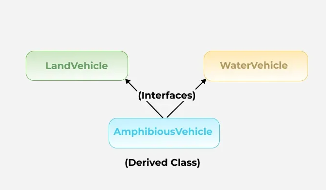
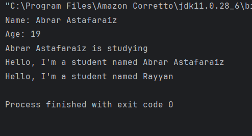
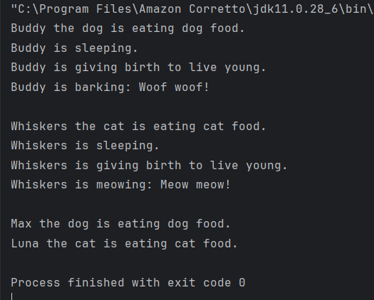
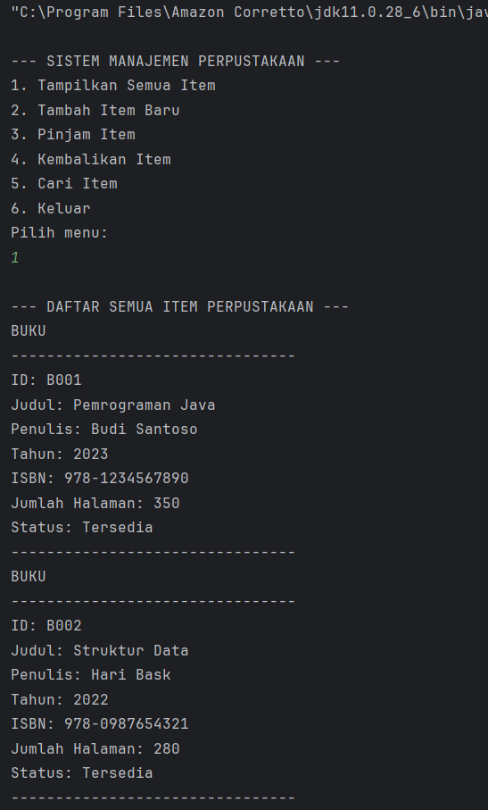
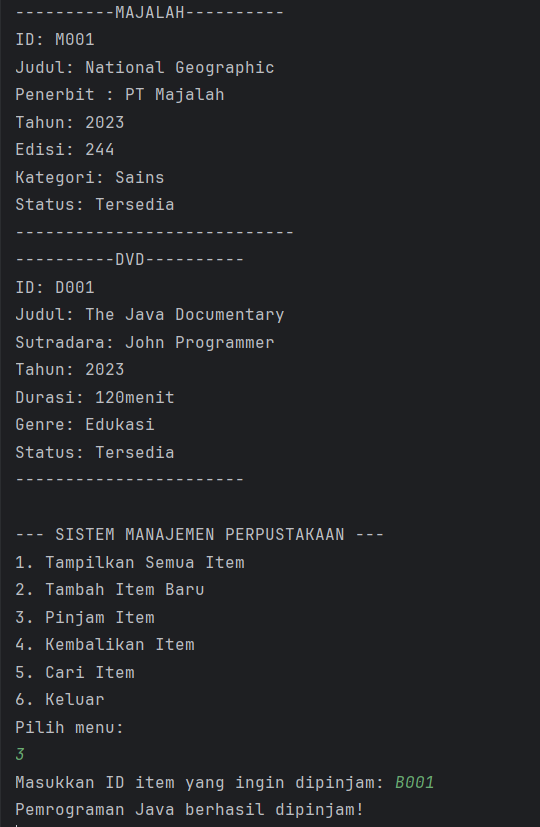
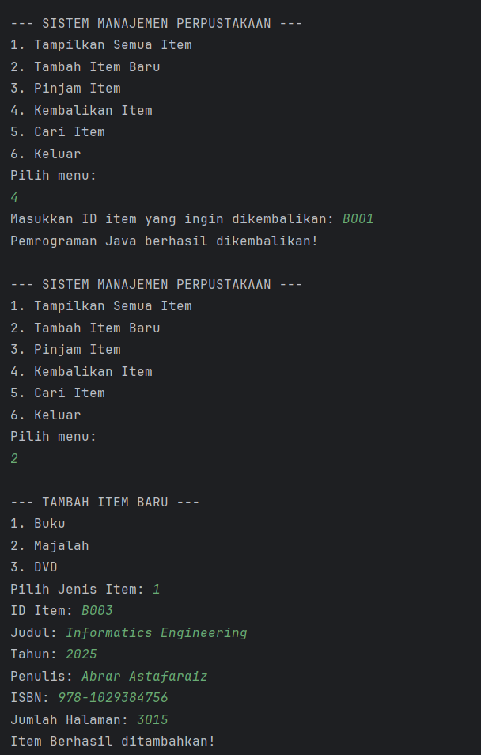
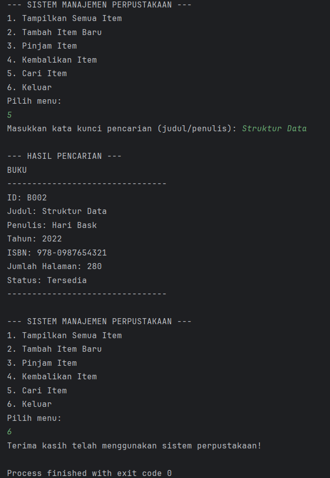

# Laporan Modul 6: Inheritance
**Mata Kuliah:** Praktikum Pemrograman Berorientasi Objek   
**Nama:** Abrar Astafaraiz  
**NIM:** 2024573010088  
**Kelas:** TI 2A

---

## BAB I - PENDAHULUAN

### 1.1 Latar Belakang

&emsp;&emsp;Inheritance (Pewarisan) adalah salah satu prinsip fundamental dalam Object-Oriented Programming (OOP) yang memungkinkan sebuah class (subclass/child class) mewarisi sifat dan perilaku dari class lain (superclass/parent class). Dengan inheritance, kita dapat menghindari duplikasi kode dan meningkatkan reusability.

### 1.2 Tujuan Inheritance

1. Code Reusability - Menggunakan kembali kode yang sudah ada tanpa menulis ulang. 
2. Method Overriding - Memungkinkan subclass mengimplementasikan ulang method dari parent class. 
3. Polymorphism - Memungkinkan objek subclass diperlakukan sebagai objek superclass. 
4. Extensibility - Memperluas fungsionalitas class yang sudah ada. 
5. Hierarchical Classification - Membuat hubungan hierarki antar class.


### 1.4 Cara Implementasi

1. Gunakan kata kunci `extends` untuk mewarisi dari sebuah class.
2. Subclass dapat mengakses anggota (fields dan methods) yang bersifat `protected` dan `public` dari superclass.
3. Subclass dapat mengoverride method dari superclass.
4. Gunakan kata kunci `super` untuk mengakses anggota superclass.

### 1.3 Jenis-jenis Inheritance
#### 1.3.1 Single Inheritance

&emsp;&emsp;Single inheritance terjadi ketika sebuah class turunan hanya mewarisi dari satu class induk. Ini adalah bentuk pewarisan yang paling sederhana, di mana class turunan mendapatkan semua metode dan properti dari satu class induk saja.


contoh : 

```declarative
//Super class
class Vehicle {
    Vehicle() {
        System.out.println("This is a Vehicle");
    }
}

// Subclass 
class Car extends Vehicle {
    Car() {
        System.out.println("This Vehicle is Car");
    }
}

public class Test {
    public static void main(String[] args) {
        // Creating object of subclass invokes base class constructor
        Car obj = new Car();
    }
}
```

#### 1.3.2 Multiple Inheritance

&emsp;&emsp;Multiple inheritance memungkinkan sebuah class turunan untuk mewarisi dari lebih dari satu class induk. Artinya, class turunan dapat menggabungkan fungsionalitas dari beberapa class induk. Multiple inheritance lebih kompleks dan harus ditangani dengan hati-hati untuk menghindari masalah seperti diamond problem, di mana class turunan mewarisi dari dua class induk yang memiliki class dasar sama.



contoh :

```declarative
interface LandVehicle {
    default void landInfo() {
    System.out.println("This is a LandVehicle");
    }
}
interface WaterVehicle {
    default void waterInfo() {
    System.out.println("This is a WaterVehicle");
    }
}
// Subclass implementing both interfaces
class AmphibiousVehicle implements LandVehicle, WaterVehicle {
    AmphibiousVehicle() {
    System.out.println("This is an AmphibiousVehicle");
    }
}
public class Test {
    public static void main(String[] args) {
    AmphibiousVehicle obj = new AmphibiousVehicle();
    obj.waterInfo();
    obj.landInfo();
    }
}
```

#### 1.3.3 Hierarchial Inheritance

&emsp;&emsp;Hierarchical inheritance terjadi saat beberapa class turunan mewarisi dari satu class induk yang sama. Jenis ini sering digunakan untuk mengelompokkan fungsionalitas yang serupa ke dalam satu class induk, sementara memungkinkan variasi dalam class turunan.


contoh :

```declarative
class Vehicle {
    Vehicle() {
    System.out.println("This is a Vehicle");
    }
}

class Car extends Vehicle {
    Car() {
    System.out.println("This Vehicle is Car");
    }
}

class Bus extends Vehicle {
    Bus() {
    System.out.println("This Vehicle is Bus");
    }
}

public class Test {
    public static void main(String[] args) {
    Car obj1 = new Car();
    Bus obj2 = new Bus();
    }
}
```

#### 1.3.4 Multilevel Inheritance

&emsp;&emsp;Dalam multilevel inheritance, sebuah class turunan mewarisi dari class turunan lain, sementara class yang sendiri mewarisi dari class induk. Jenis ini menciptakan "rantai" pewarisan. Misalnya, class C mewarisi dari class B, dan class B mewarisi dari class A.


contoh :

```declarative
class Vehicle {
    Vehicle() {
    System.out.println("This is a Vehicle");
    }
}
class FourWheeler extends Vehicle {
    FourWheeler() {
    System.out.println("4 Wheeler Vehicles");
    }
}
class Car extends FourWheeler {
    Car() {
    System.out.println("This 4 Wheeler Vehicle is a Car");
    }
}
public class Geeks {
    public static void main(String[] args) {
    Car obj = new Car(); // Triggers all constructors in order
    }
}
```

#### 1.3.5 Hybrid Inheritance

&emsp;&emsp;Hybrid inheritance adalah kombinasi dari dua atau lebih jenis inheritance yang sebelumnya sudah disebutkan di atas. Kondisi ini sering terjadi dalam sistem yang lebih kompleks, di mana berbagai bentuk inheritance dipakai bersama-sama untuk mencapai fleksibilitas dan efisiensi yang diinginkan.


---

## BAB II - PRAKTIKUM
### 2.1 Praktikum 1 - Memahami Single Inheritance
#### 2.1.1 Tujuan

&emsp;&emsp;Memahami konsep dan implementasi single inheritance.

#### 2.1.2 Langkah Praktikum
1. Buat sebuah package baru di dalam package `modul_6` dengan nama `praktikum_1` 
2. Buat class `Person` sebagai superclass:
```declarative
package modul_6.praktikum_1;

public class Person {
    protected String name;
    protected int age;
    
    public Person(String name, int age) {
        this.name = name;
        this.age = age;
    }
    
    public void displayInfo(){
        System.out.println("Name: " + name);
        System.out.println("Age: " + age);
    }
    
    public void greet(){
        System.out.println("Hello, I'm a person");
    }
}
```

3. Buat class `Student` sebagai subclass yang mewarisi Person:
```declarative
package modul_6.praktikum_1;

public class Student extends Person {
    private String studentId;
    
    public Student(String name, int age, String number) {
        super(name, age);
        this.studentId = studentId;
    }
    
    public void study() {
        System.out.println(name + " is studying");
    }
    
    @Override
    public void greet() {
        System.out.println("Hello, I'm a student named " + name);
    }
}

```
4. Buat class `InheritanceTest` untuk testing:
```declarative
package modul_6.praktikum_1;

public class InheritanceTest {
    public static void main(String[] args) {
        Student student = new Student("Abrar Astafaraiz", 19, "2024573010088");

        student.displayInfo();

        student.study();

        student.greet();

        // Polymorphism Student sebagai Person
        Person person = new Student("Rayyan", 19, "2024573010119");
        person.greet(); // Setelah Override
    }
}
```

5. Jalankan program dan amati hasilnya
6. Perhatikan bagaimana subclass mewarisi dan memperluas fungsionalitas superclass

#### 2.1.3 Hasil Praktikum



### 2.2 Praktikum 2 - Method Overriding dan Kata Kunci `super`
#### 2.2.1 Teori Dasar

&emsp;&emsp;Method overriding memungkinkan subclass memberikan implementasi spesifik untuk method yang sudah didefinisikan di superclass. Kata kunci `super` digunakan untuk mengakses anggota superclass.

##### 2.2.1.1 Aturan Method Overriding

1. Method harus memiliki nama dan parameter yang sama 
2. Return type harus sama atau subtype (covariant return type)
3. Access modifier tidak boleh lebih restriktif 
4. Tidak bisa override method yang `final` atau `static`

##### 2.2.1.2 Penggunaan super

1. `super()` - Memanggil constructor superclass 
2. `super.methodName()` - Memanggil method superclass 
3. `super.variableName` - Mengakses variable superclass

#### 2.2.2 Tujuan

&emsp;&emsp;Memahami cara melakukan method overriding dan penggunaan kata kunci `super`.

#### 2.2.3 Langkah Praktikum

1. Buat sebuah package baru di dalam package `modul_6` dengan nama `praktikum_2` 
2. Buat class `Vehicle` sebagai superclass:
```declarative
package modul_6.praktikum_2;

public class Vehicle {
    protected  String brand;
    protected int speed;
    
    public Vehicle(String brand, int speed){
        this.brand = brand;
        this.speed = speed;
    }
    
    public void start(){
        System.out.println("Vehicle is starting");
    }

    public void displayInfo(){
        System.out.println("Brand: " + brand);
        System.out.println("Speed: " + speed + " km/h");
    }
}
```

3. Buat class `Car` sebagai subclass yang mewarisi `Vehicle`:
```declarative
package modul_6.praktikum_2;

public class Car extends Vehicle{
    private int numberOfDoors;
    
    public Car(String brand, int speed, int numberOfDoors){
        super(brand, speed);
        this.numberOfDoors = numberOfDoors;
    }
    
    @Override
    public void start(){
        super.start();
        System.out.println("Car engine is running smoothly");
    }
    
    @Override
    public void displayInfo(){
        super.displayInfo();
        System.out.println("Number of Doors: " + numberOfDoors);
    }
    
    public void honk(){
        System.out.println("Beep beep!");
    }
}
```

4. Buat class `OverrideTest` untuk testing:
```declarative
package modul_6.praktikum_2;

public class OverrideTest {
    public static void main(String[] args) {
        Car car = new Car("Toyota", 180, 4);

        // Override Method
        car.start();
        car.displayInfo();
        car.honk();

        // Demonstrasi polymorphism
        Vehicle vehicle = new Car("Honda", 200, 2);
        vehicle.start();
        vehicle.displayInfo();
    }
}
```

5. Jalankan program dan amati:
* Cara method overriding bekerja 
* Penggunaan kata kunci super untuk mengakses superclass 
* Konsep polymorphism dalam inheritance

#### 2.2.4 Screenshoot Hasil


### 2.3 Praktikum 3 - Multilevel dan Hierarchical Inheritance
#### 2.3.1 Tujuan

&emsp;&emsp;Memahami konsep multilevel dan hierarchical inheritance.

#### 2.3.2 Langkah Praktikum
1. Buat sebuah package baru di dalam package `modul_6` dengan nama `praktikum_3` 
2. Buat class `Animal` sebagai superclass:
```declarative
package modul_6.praktikum_3;

public class Animal {
    protected String name;
    
    public Animal(String name){
        this.name = name;
    }
    
    public void eat(){
        System.out.println(name + " is eating.");
    }
    
    public void sleep(){
        System.out.println(name + " is sleeping.");
    }
}
```

3. Buat class `Mammal` yang mewarisi `Animal` (multilevel inheritance):
```declarative
package modul_6.praktikum_3;

public class Mammal extends Animal{
    protected String furColor;
    
    public Mammal (String name, String furColor){
        super(name);
        this.furColor = furColor;
    }
    
    public void giveBirth(){
        System.out.println(name + " is giving birth to live young.");
    }
}
```

4. Buat class `Dog` yang mewarisi `Mammal` (multilevel inheritance):
```declarative
package modul_6.praktikum_3;

public class Dog extends Mammal{
    private String breed;

    public Dog(String name, String furColor, String breed){
        super(name, furColor);
        this.breed = breed;
    }

    public void bark(){
        System.out.println(name + " is barking: Woof woof!");
    }

    @Override
    public void eat() {
        System.out.println(name + " the dog is eating dog food.");
    }
}
```

5. Buat class `Cat` yang mewarisi `Mammal` (hierarchical inheritance):
```declarative
package modul_6.praktikum_3;

public class Cat extends Mammal{
    private Boolean isIndoor;

    public Cat(String name, String furColor, Boolean isIndoor){
        super(name, furColor);
        this.isIndoor = isIndoor;
    }

    public void meow(){
        System.out.println(name + " is meowing: Meow meow!");
    }

    @Override
    public void eat() {
        System.out.println(name + " the cat is eating cat food.");
    }
}
```

6. Buat class `InheritanceTypeTest` untuk testing:
```declarative
package modul_6.praktikum_3;

public class InheritanceTypeTest {
    public static void main(String[] args) {
        // Multilevel Inheritance Test
        Dog dog = new Dog("Buddy", "Brown", "Golden Retriever");

        dog.eat();
        dog.sleep();
        dog.giveBirth();
        dog.bark();

        System.out.println();

        // Hierarchical Inheritance Test
        Cat cat = new Cat("Whiskers", "White", true);

        cat.eat();
        cat.sleep();
        cat.giveBirth();
        cat.meow();

        System.out.println();

        // Polymorphism dengan Hierarchical Inheritance
        Animal[] animals = {new Dog("Max", "Black", "Labrador"),
                            new Cat("Luna", "Gray", false)};

        for (Animal animal : animals) {
            animal.eat(); // Panggil Method
        }
    }
}
```

7. Jalankan program dan amati:
* Cara multilevel inheritance membentuk rantai pewarisan. 
* Cara hierarchical inheritance memungkinkan multiple class mewarisi dari satu superclass. 
* Polymorphism bekerja dengan inheritance hierarchy.

#### 2.3.3 Screenshoot Hasil



### 2.3 Praktikum 4 - Sistem Manajemen Perpustakaan Sederhana
#### 2.3.1 Tujuan

&emsp;&emsp;Menerapkan konsep inheritance dalam project real-world sederhana untuk mengelola sistem perpustakaan.

#### 2.3.2 Deskripsi Project

&emsp;&emsp;Kita akan membuat sistem manajemen perpustakaan sederhana yang memiliki berbagai jenis item (buku, majalah, DVD) dengan karakteristik yang berbeda namun memiliki beberapa kesamaan.

#### 2.3.3 Langkah Praktikum
1. Buat sebuah package baru di dalam package `modul_6` dengan nama `praktikum_4`
2. Buat class `LibraryItem` sebagai superclass:
```declarative
package modul_6.praktikum_4;

public abstract class LibraryItem {
    protected String itemId;
    protected String title;
    protected int year;
    protected boolean isAvailable;
    
    public LibraryItem(String itemId, String title, int year) {
        this.itemId = itemId;
        this.title = title;
        this.year = year;
        this.isAvailable = true;
    }
    
    public String getItemId() {
        return itemId;
    }

    public String getTitle() {
        return title;
    }

    public int getYear() {
        return year;
    }

    public boolean isAvailable() {
        return isAvailable;
    }
    
    public void setAvailable(boolean available) {
        isAvailable = available;
    }
    
    public abstract void displayInfo();
    
    public void borrowItem() {
        if (isAvailable) {
            isAvailable = false;
            System.out.println(title + " berhasil dipinjam!");
        } else {
            System.out.println(title + " sedang tidak tersedia!");
        }
    }
    
    public void returnItem() {
        isAvailable = true;
        System.out.println(title + " berhasil dikembalikan!");
    }
}
```

3. Buat class `Book` yang mewarisi `LibraryItem`:
```declarative
package modul_6.praktikum_4;

public class Book extends LibraryItem {
    private String author;
    private String isbn;
    private int numberOfPages;
    
    public Book(String itemId, String title, int year, String author, String isbn, int numberOfPages) {
        super(itemId, title, year);
        this.author = author;
        this.isbn = isbn;
        this.numberOfPages = numberOfPages;
    }
    
    @Override
    public void displayInfo() {
        System.out.println("BUKU");
        System.out.println("--------------------------------");
        System.out.println("ID: " + itemId);
        System.out.println("Judul: " + title);
        System.out.println("Penulis: " + author);
        System.out.println("Tahun: " + year);
        System.out.println("ISBN: " + isbn);
        System.out.println("Jumlah Halaman: " + numberOfPages);
        System.out.println("Status: " + (isAvailable ? "Tersedia" : "Dipinjam"));
        System.out.println("--------------------------------");
    }
    
    public void readSample() {
        System.out.println("Membaca sampel dari buku: " + title);
    }
}
```

4. Buat class `Magazine` yang mewarisi `LibraryItem`:
```declarative
package modul_6.praktikum_4;

public class Magazine extends LibraryItem {
    private String publisher;
    private int issueNumber;
    private String category;
    
    public Magazine(String itemId, String title, int year, String publisher, int issueNumber, String category) {
        super(itemId, title, year);
        this.publisher = publisher;
        this.issueNumber = issueNumber;
        this.category = category;
    }
    
    @Override
    public void displayInfo() {
        System.out.println("----------MAJALAH----------");
        System.out.println("ID: " + itemId);
        System.out.println("Judul: " + title);
        System.out.println("Penerbit : " + publisher);
        System.out.println("Tahun: " + year);
        System.out.println("Edisi: " + issueNumber);
        System.out.println("Kategori: " + category);
        System.out.println("Status: " + (isAvailable ? "Tersedia" : "Dipinjam"));
        System.out.println("----------------------------");
    }
    
    public void browseArticles() {
        System.out.println("Menelusuri artikel dalam majalah: " + title);
    }
}
```

5. Buat class `DVD` yang mewarisi `LibraryItem`:
```declarative
package modul_6.praktikum_4;

public class DVD extends LibraryItem {
    private String director;
    private int duration;
    private String genre;
    
    public DVD(String itemId, String title, int year, String director, int duration, String genre) {
        super(itemId, title, year);
        this.director = director;
        this.duration = duration;
        this.genre = genre;
    }
    
    @Override
    public void displayInfo() {
        System.out.println("----------DVD----------");
        System.out.println("ID: " + itemId);
        System.out.println("Judul: " + title);
        System.out.println("Sutradara: " + director);
        System.out.println("Tahun: " + year);
        System.out.println("Durasi: " + duration + "menit");
        System.out.println("Genre: " + genre);
        System.out.println("Status: " + (isAvailable() ? "Tersedia" : "Dipinjam"));
        System.out.println("-----------------------");
    }
    
    public void playTrailer() {
        System.out.println("Memutar trailer DVD: " + title);
    }
}
```

6. Buat class `LibraryManagementSystem` sebagai main class:
```declarative
package modul_6.praktikum_4;

import java.util.ArrayList;
import java.util.Scanner;

public class LibraryManagementSystem {
    private static ArrayList<LibraryItem> libraryItems = new ArrayList<>();
    private static Scanner scanner = new Scanner(System.in);

    public static void main(String[] args) {
        initializeSampleData();

        while (true) {
            displayMenu();
            int choice = scanner.nextInt();
            scanner.nextLine(); // consume newline

            switch (choice) {
                case 1:
                    displayAllItems();
                    break;
                case 2:
                    addItem();
                    break;
                case 3:
                    borrowItem();
                    break;
                case 4:
                    returnItem();
                    break;
                case 5:
                    searchItem();
                    break;
                case 6:
                    System.out.println("Terima kasih telah menggunakan sistem perpustakaan!");
                    return;
                default:
                    System.out.println("Pilihan menu tidak valid!");
            }
        }
    }

    private static void displayMenu() {
        System.out.println("\n--- SISTEM MANAJEMEN PERPUSTAKAAN ---");
        System.out.println("1. Tampilkan Semua Item");
        System.out.println("2. Pinjam Item");
        System.out.println("3. Kembalikan Item");
        System.out.println("4. Tambah Item Baru");
        System.out.println("5. Cari Item");
        System.out.println("6. Keluar");
        System.out.println("Pilih menu: ");
    }

    private static void initializeSampleData() {
        libraryItems.add(new Book("B001", "Pemrograman Java", 2023, "Budi Santoso", "978-1234567890", 350));
        libraryItems.add(new Book("B002", "Struktur Data", 2022, "Hari Bask", "978-0987654321", 280));
        libraryItems.add(new Magazine("M001", "National Geographic", 2023, "PT Majalah", 244, "Sains"));
        libraryItems.add(new DVD("D001", "The Java Documentary", 2023, "John Programmer", 120, "Edukasi"));
    }

    private static void displayAllItems() {
        System.out.println("\n--- DAFTAR SEMUA ITEM PERPUSTAKAAN ---");
        for (LibraryItem item : libraryItems) {
            item.displayInfo();
        }
    }

    private static void borrowItem() {
        System.out.print("Masukkan ID item yang ingin dipinjam: ");
        String itemId = scanner.nextLine();

        for (LibraryItem item : libraryItems) {
            if (item.getItemId().equalsIgnoreCase(itemId)) {
                item.borrowItem();
                return;
            }
        }

        System.out.println("Item dengan ID " + itemId + " tidak ditemukan!");
    }

    private static void returnItem() {
        System.out.print("Masukkan ID item yang ingin dikembalikan: ");
        String itemId = scanner.nextLine();

        for (LibraryItem item : libraryItems) {
            if (item.getItemId().equalsIgnoreCase(itemId)) {
                item.returnItem();
                return;
            }
        }

        System.out.println("Item dengan ID " + itemId + " tidak ditemukan!");
    }

    // --- Bagian dari Gambar Kedua ---

    private static void addItem() {
        System.out.println("\n--- TAMBAH ITEM BARU ---");
        System.out.println("1. Buku");
        System.out.println("2. Majalah");
        System.out.println("3. DVD");
        System.out.print("Pilih Jenis Item: ");
        int type = scanner.nextInt();
        scanner.nextLine(); // consume newline

        System.out.print("ID Item: ");
        String itemId = scanner.nextLine();
        System.out.print("Judul: ");
        String title = scanner.nextLine();
        System.out.print("Tahun: ");
        int year = scanner.nextInt();
        scanner.nextLine(); // consume newline

        switch (type) {
            case 1:
                System.out.print("Penulis: ");
                String author = scanner.nextLine();
                System.out.print("ISBN: ");
                String isbn = scanner.nextLine();
                System.out.print("Jumlah Halaman: ");
                int pages = scanner.nextInt();
                scanner.nextLine();
                libraryItems.add(new Book(itemId, title, year, author, isbn, pages));
                break;
            case 2:
                System.out.print("Penerbit: ");
                String publisher = scanner.nextLine();
                System.out.print("Edisi: ");
                int issue = scanner.nextInt();
                scanner.nextLine();
                System.out.print("Kategori: ");
                String category = scanner.nextLine();
                libraryItems.add(new Magazine(itemId, title, year, publisher, issue, category));
                break;
            case 3:
                System.out.print("Sutradara: ");
                String director = scanner.nextLine();
                System.out.print("Durasi (menit): ");
                int duration = scanner.nextInt();
                scanner.nextLine();
                System.out.print("Genre: ");
                String genre = scanner.nextLine();
                libraryItems.add(new DVD(itemId, title, year, director, duration, genre));
                break;
            default:
                System.out.println("Jenis Item tidak valid!");
                return;
        }

        System.out.println("Item Berhasil ditambahkan!");
    }

    private static void searchItem() {
        System.out.print("Masukkan kata kunci pencarian (judul/penulis): ");
        String keyword = scanner.nextLine().toLowerCase();

        System.out.println("\n--- HASIL PENCARIAN ---");
        boolean found = false;

        for (LibraryItem item : libraryItems) {
            String titleLower = item.getTitle().toLowerCase();

            String searchString = titleLower;
            if (item instanceof Book) {
                if (titleLower.contains(keyword)) {
                    item.displayInfo();
                    found = true;
                }
            } else {
                if (titleLower.contains(keyword)) {
                    item.displayInfo();
                    found = true;
                }
            }
        }

        if (!found) {
            System.out.println("Tidak ada item yang sesuai dengan pencarian.");
        }
    }
}
```

7. Jalankan program dan amati:
* Cara multilevel inheritance membentuk rantai pewarisan.
* Cara hierarchical inheritance memungkinkan multiple class mewarisi dari satu superclass.
* Polymorphism bekerja dengan inheritance hierarchy.

#### 2.3.4 Screenshoot Hasil






---

## BAB III - PENUTUP

### 3.1 Kesimpulan

&emsp;&emsp;Berdasarkan pembahasan pada modul ini, konsep inheritance merupakan salah satu pilar utama dalam Pemrograman Berorientasi Objek (OOP). Melalui inheritance, sebuah class dapat mewarisi atribut dan method dari class lain, sehingga proses pengembangan menjadi lebih terstruktur, terorganisir, dan mudah dipahami. Penerapan inheritance memungkinkan pengelompokan objek berdasarkan karakteristik yang serupa, sehingga kode lebih efisien dan tidak berulang.

&emsp;&emsp;Praktikum yang dilakukan menunjukkan bagaimana berbagai jenis inheritance seperti single, multilevel, hierarchical, multiple, dan hybrid dapat diterapkan dalam program. Setiap jenis inheritance memiliki kegunaan masing-masing, mulai dari pewarisan sederhana satu tingkat hingga kombinasi kompleks yang melibatkan banyak struktur. Penggunaan method overriding dan kata kunci super juga memberikan fleksibilitas bagi programmer untuk menyesuaikan perilaku subclass tanpa menghapus fungsi dasar dari superclass.

&emsp;&emsp;Hasil praktikum juga memperkuat pemahaman mengenai polymorphism yang menjadi konsekuensi penting dari inheritance. Polymorphism memungkinkan objek subclass diperlakukan sebagai objek superclass, sehingga memberikan kemampuan adaptasi yang lebih luas dalam sistem yang kompleks. Hal ini dibuktikan melalui beberapa contoh seperti pewarisan pada class Person–Student, Vehicle–Car, hingga sistem multilevel Animal–Mammal–Dog dan hierarchical Mammal–Cat, yang semuanya memperlihatkan mekanisme pemanggilan method sesuai kelas masing-masing.

&emsp;&emsp;Secara keseluruhan, modul ini memberikan gambaran nyata tentang bagaimana inheritance diterapkan dalam pengembangan perangkat lunak. Selain memperlihatkan teori dasar, modul ini juga memberikan kesempatan untuk mengembangkan program sederhana seperti sistem manajemen perpustakaan yang menunjukkan penerapan inheritance di dunia nyata. Dengan demikian, mahasiswa dapat memahami manfaat inheritance sebagai fondasi untuk membangun program yang lebih besar, terstruktur, dan mudah dikembangkan di masa depan.

---

## BAB IV - REFERENSI
Modul Praktikum 6 by Pak Muhammad Reza Zulman, S.ST., M.Sc.
* https://hackmd.io/@mohdrzu/r1Cxc-p0eg

Web W3Schools bagian Java OOP – Inheritance
* https://www.w3schools.com/java/java_inheritance.asp

Web GeeksforGeeks bagian Inheritance in Java
* https://www.geeksforgeeks.org/inheritance-in-java/