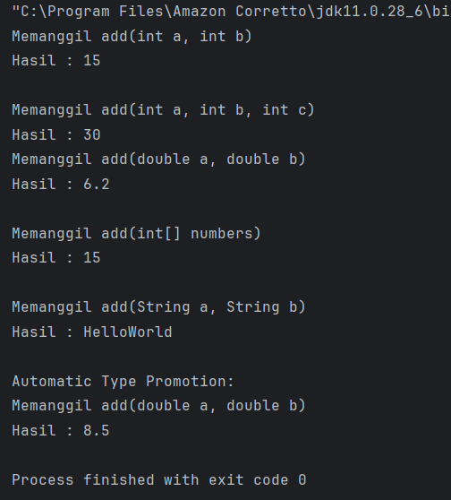

# Laporan Modul 7: Polymorphism
**Mata Kuliah:** Praktikum Pemrograman Berorientasi Objek   
**Nama:** Abrar Astafaraiz  
**NIM:** 2024573010088  
**Kelas:** TI 2A

---

## BAB I - PENDAHULUAN

### 1.1 Latar Belakang

&emsp;&emsp;Dalam konteks pemrograman OOP (Object Oriented Programming), istilah polymorphism sering digunakan karena berkaitan erat dengan salah satu pilar seperti class, object, method, atau inheritance. Polymorphism adalah banyak bentuk atau bermacam-macam. Dalam istilah pemrograman, polymorphism adalah sebuah konsep di mana sebuah interface tunggal digunakan pada entitas yang berbeda-beda. Umumnya, penggunaan suatu simbol tunggal berfungsi untuk mewakili beberapa jenis tipe entitas.

&emsp;&emsp;Polymorphism adalah konsep pemrograman yang berorientasi pada objek yang mengacu pada kemampuan variabel, fungsi atau objek untuk mengambil beberapa bentuk. Polymorphism adalah penggunaan salah satu item seperti fungsi, atribut, atau interface pada berbagai jenis objek yang berbeda dalam bahasa pemrograman. Dalam bahasa pemrograman yang menunjukkan polimorfisme, objek kelas miliki hierarki yang sama yang diwariskan dari kelas induk yang sama, mungkin memiliki fungsi dengan nama yang sama, tetapi dengan perilaku berbeda.Inheritance (Pewarisan) adalah salah satu prinsip fundamental dalam Object-Oriented Programming (OOP) yang memungkinkan sebuah class (subclass/child class) mewarisi sifat dan perilaku dari class lain (superclass/parent class). Dengan inheritance, kita dapat menghindari duplikasi kode dan meningkatkan reusability.


### 1.2 Tujuan Polymorphism

1. Flexibility - Memungkinkan kode yang lebih fleksibel dan mudah diperluas.
2. Code Reusability - Mengurangi duplikasi kode dengan menggunakan interface yang sama.
3. Maintainability - Memudahkan maintenance dan pengembangan fitur baru.
4. Dynamic Behavior - Perilaku objek ditentukan pada runtime
5. Interface Consistency - Konsistensi dalam penggunaan interface

### 1.4 Cara Implementasi

1. Gunakan inheritance hierarchy
2. Override method di subclass
3. Gunakan reference superclass untuk memegang objek subclass
4. Method yang dipanggil ditentukan pada runtime berdasarkan tipe aktual objek

### 1.3 Jenis-jenis Polymorphism
#### 1.3.1 Compile-time Polymorphism (Method Overloading)

&emsp;&emsp;Method overloading terjadi di mana sebuah class memiliki beberapa method dengan nama yang sama tetapi berbeda pada jumlah, tipe, atau urutan parameternya. Penentuan method mana yang digunakan dilakukan oleh compiler saat proses kompilasi, sehingga memberikan fleksibilitas dalam penggunaan method yang memiliki tujuan serupa namun menerima jenis input berbeda. Overloading membuat kode lebih efisien, mudah dibaca, dan menghindari penggunaan nama method yang terlalu banyak untuk fungsi yang sebenarnya sejenis.

**Aturan Method Overloading**

* Method harus memiliki nama dan parameter yang sama dengan method di superclass.
* Return type harus sama atau subtype dari return type di superclass.
* Access modifier tidak boleh lebih restriktif daripada method di superclass (misalnya, jika method di superclass protected, method di subclass bisa protected atau public).
* Method tidak bisa di-override jika di superclass dideklarasikan sebagai final.

#### 1.3.2 Runtime Polymorphism (Method Overriding)

&emsp;&emsp;Method overriding terjadi ketika subclass (class anak) menyediakan implementasi spesifik untuk method yang sudah didefinisikan di superclass (class induk). Method overriding digunakan untuk mengubah atau memperluas perilaku method yang diwarisi dari superclass. Method yang di-override harus memiliki nama, parameter, dan return type yang sama dengan method di superclass.

**Aturan Method Overriding**

* Memiliki nama method yang sama.
* Parameter harus berbeda (jumlah, tipe, atau urutan parameter).
* Return type boleh sama atau berbeda, karena tidak memengaruhi overloading.
* Boleh menggunakan access modifier atau tipe return bebas selama parameter berbeda.
* Overloading dapat terjadi dalam satu class atau antara superclass dan subclass.

---

## BAB II - PRAKTIKUM
### 2.1 Praktikum 1 - Memahami Method Overloading (Compile-time Polymorphism)
#### 2.1.1 Tujuan

&emsp;&emsp;Memahami konsep dan implementasi method overloading.

#### 2.1.2 Langkah Praktikum
1. Buat sebuah package baru di dalam package `modul_7` dengan nama `praktikum_1`
   Buat class `Calculator` dengan method overloading:
```declarative
package modul_7.praktikum_1;

public class Calculator {
    public int add(int a, int b) {
        System.out.println("Memanggil add(int a, int b)");
        return a + b;
    }
    
    public int add(int a, int b, int c) {
        System.out.println("Memanggil add(int a, int b, int c)");
        return a + b + c;
    }
    
    public double add(double a, double b) {
        System.out.println("Memanggil add(double a, double b)");
        return a + b;
    }
    
    public int add(int[] numbers) {
        System.out.println("Memanggil add(int[] numbers)");
        int sum = 0;
        for (int num : numbers) {
            sum += num;
        }
        return sum;
    }
    
    public String add(String a, String b) {
        System.out.println("Memanggil add(String a, String b)");
        return a + b;
    }
}
```

3. Buat class `OverloadingTest` untuk testing:
```declarative
package modul_7.praktikum_1;

public class OverloadingTest {
    public static void main(String[] args) {
        Calculator calc = new Calculator();
        
        System.out.println("Hasil : " + calc.add(5, 10));
        System.out.println();
        
        System.out.println("Hasil : " + calc.add(5, 10, 15));
        
        System.out.println("Hasil : " + calc.add(3.5, 2.7));
        System.out.println();
        
        int[] numbers = {1, 2, 3, 4, 5};
        System.out.println("Hasil : " + calc.add(numbers));
        System.out.println();
        
        System.out.println("Hasil : " + calc.add("Hello", "World"));
        System.out.println();
        
        System.out.println("Automatic Type Promotion:");
        System.out.println("Hasil : " + calc.add(5, 3.5));
    }
}
```

4. Jalankan program dan amati hasilnya
5. Perhatikan bagaimana compiler memilih method yang tepat berdasarkan parameter

#### 2.1.3 Hasil Praktikum



### 2.2 Praktikum 2 - Memahami Method Overriding (Runtime Polymorphism)
#### 2.2.1 Tujuan

&emsp;&emsp;Memahami konsep runtime polymorphism melalui method overriding.

#### 2.2.2 Langkah Praktikum
1. Buat sebuah package baru di dalam package `modul_7` dengan nama `praktikum_2`
2. Buat class `Shape` sebagai superclass:
```declarative
package modul_7.praktikum_2;

public class Shape {
    protected String color;
    
    public Shape(String color) {
        this.color = color;
    }
    
    public void draw() {
        System.out.println("Menggambar shape dengan warna : " + color);
    }
    
    public double calculateArea() {
        System.out.println("Menghitung luas secara umum");
        return 0.0;
    }
    
    public void displayInfo() {
        System.out.println("Shape - Warna : " + color);
    }
}
```

3. Buat class `Circle` yang mewarisi `Shape`:
```declarative
package modul_7.praktikum_2;

public class Circle extends Shape {
    private double radius;
    
    
    public Circle(String color, double radius) {
    super(color);
    this.radius = radius;
    }
    
    @Override
    public void draw() {
    System.out.println("Menggambar lingkaran dengan warna : " + color + " dan radius : " + radius);
    }
    
    @Override
    public double calculateArea() {
    double area = Math.PI * radius * radius;
    System.out.println("Luas Lingkaran : " + area);
    return area;
    }
    
    @Override
    public void displayInfo() {
    System.out.println("Lingkaran - Warna : " + color + ", dan Radius : " + radius);
    }
}
```

4. Buat class `Rectangle` yang mewarisi `Shape`:
```declarative
package modul_7.praktikum_2;

public class Rectangle extends Shape {
    private double width;
    private double height;
    
    public Rectangle(String color, double width, double height) {
        super(color);
        this.width = width;
        this.height = height;
    }
    
    @Override
    public void draw() {
        System.out.println("Menggambar Persegi Panjang dengan warna : " + color + ", Lebar : " + width + ", dan Tinggi : " + height);
    }
    
    @Override
    public double calculateArea() {
        double area = width * height;
        System.out.println("Luas Persegi Panjang : " + area);
        return area;
    }
    
    @Override
        public void displayInfo() {
        System.out.println("Persegi Panjang - Warna : " + color + ", Lebar : " + width + ", dan Tinggi : " + height);
    }
}
```

5. Buat class `Triangle` yang mewarisi `Shape`:
```declarative
package modul_7.praktikum_2;

public class Triangle extends Shape {
    private double base;
    private double height;
    
    public Triangle(String color, double base, double height) {
        super(color);
        this.base = base;
        this.height = height;
    }
    
    @Override
    public void draw() {
        System.out.println("Menggambar Segitiga dengan warna : " + color + ", Alas : " + base + ", dan Tinggi : " + height);
    }
    
    @Override
    public double calculateArea() {
        double area = 0.5 * base * height;
        System.out.println("Luas Segitiga : " + area);
        return area;
    }
    
    @Override
    public void displayInfo() {
        System.out.println("Segitiga - Warna : " + color + ", Alas : " + base + ", dan Tinggi : " + height);
    }
}
```

6. Buat class `PolymorphismTest` untuk testing:
```declarative
package modul_7.praktikum_2;

public class PolymorphismTest {
    public static void main(String[] args) {
        Shape[] shapes = new Shape[3];
        shapes[0] = new Circle("Merah", 5.0);
        shapes[1] = new Rectangle("Biru", 4.0,  6.0);
        shapes[2] = new Triangle("Hijau", 3.0, 4.0);
        
        System.out.println("--- POLYMORPHISM RUNTIME ---");
        for (Shape shape : shapes) {
            shape.draw();
            shape.calculateArea();
            shape.displayInfo();
            System.out.println();
        }
        
        System.out.println("--- INDIVIDUAL OBJECTS ---");
        Shape shape1 = new Circle("Kuning", 7.0);
        Shape shape2 = new Rectangle("Ungu", 5.0,  8.0);
        
        shape1.draw();
        shape2.draw();
        
        System.out.println("--- INDIVIDUAL OBJECTS ---");
        for (Shape shape : shapes) {
            if (shape instanceof Circle) {
                Circle circle = (Circle) shape;
                System.out.println("Ini adalah Circle dengan radius : " + circle.calculateArea());
            } else if (shape instanceof Rectangle) {
                Rectangle rectangle = (Rectangle) shape;
                System.out.println("Ini adalah Rectangle dengan luas: " + rectangle.calculateArea());
            } else if (shape instanceof Triangle) {
                Triangle triangle = (Triangle) shape;
                System.out.println("Ini adalah Triangle dengan luas: " + triangle.calculateArea());
            }
        }
    }
}
```

7. Jalankan program dan amati:
* Bagaimana method yang dipanggil ditentukan pada runtime
* Perilaku polimorfik dari objek-objek berbeda
* Penggunaan instanceof untuk type checking

#### 2.2.3 Screenshoot Hasil


---

## BAB III - PENUTUP

### 3.1 Kesimpulan

&emsp;&emsp;Polymorphism merupakan konsep fundamental dalam Pemrograman Berorientasi Objek yang memungkinkan sebuah method atau objek memiliki perilaku berbeda meskipun menggunakan nama atau interface yang sama. Melalui konsep ini, sebuah program dapat beradaptasi dengan berbagai bentuk objek yang berbeda tanpa perlu membuat banyak struktur kode baru. Hal ini membuat polymorphism menjadi salah satu pilar penting dalam membangun sistem yang fleksibel dan mudah dikembangkan.

&emsp;&emsp;Pada praktikum ini, mahasiswa mempelajari dua jenis utama polymorphism, yaitu compile-time polymorphism melalui method overloading dan runtime polymorphism melalui method overriding. Method overloading memberikan kemampuan untuk membuat beberapa versi method dengan parameter berbeda, sementara method overriding memungkinkan subclass memberikan implementasi baru dari method yang diwarisi dari superclass. Kedua konsep ini menunjukkan bagaimana polymorphism bekerja baik pada proses kompilasi maupun saat program dijalankan.

&emsp;&emsp;Melalui uji coba penggunaan class Calculator dan berbagai shape seperti Circle, Rectangle, serta Triangle, mahasiswa dapat melihat bagaimana Java memilih method yang tepat berdasarkan parameter atau tipe objek aktual. Praktikum ini juga menunjukkan bagaimana penggunaan reference superclass dapat digunakan untuk menyimpan berbagai objek subclass, serta bagaimana runtime polymorphism memungkinkan program bekerja secara lebih dinamis dan sesuai konteks.

&emsp;&emsp;Secara keseluruhan, praktikum Polymorphism ini memberikan pemahaman yang kuat mengenai bagaimana konsep ini meningkatkan fleksibilitas, efisiensi, dan ketertataan dalam pemrograman berorientasi objek. Dengan menguasai polymorphism, mahasiswa akan lebih siap dalam mengembangkan aplikasi berskala besar yang membutuhkan struktur kode yang mudah dipelihara, diperluas, dan mampu beradaptasi dengan berbagai kebutuhan fungsional di masa mendatang.

---

## BAB IV - REFERENSI
Modul Praktikum 7 by Pak Muhammad Reza Zulman, S.ST., M.Sc.
* https://hackmd.io/@mohdrzu/BJlT87vJZe

Web W3Schools bagian Java OOP – Polymorphism
* https://www.w3schools.com/java/java_polymorphism.asp

Web GeeksforGeeks bagian Polymorphism in Java
* https://www.geeksforgeeks.org/polymorphism-in-java/